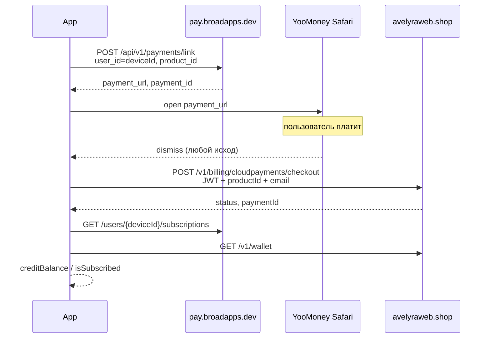

# RU-покупка в iOS-клиенте 5112 (Gigachat)

Документ описывает **текущий** флоу оплаты для RU-региона. Актуально на 03.07.2026.

---

## Два идентификатора пользователя

| ID | Пример | Где используется |
|----|--------|------------------|
| **deviceId** | `55cbe083-fcbd-4460-af62-06f9a7bea97c` | Broadapps (`pay.broadapps.dev`): оплата, подписка, эксперименты |
| **userId (JWT)** | `b0f407bd-4a19-449e-beab-84ce341d6915` | Broadnova (`avelyraweb.shop`): кредиты, policy, чат |

`deviceId` и `userId` — **разные сущности**. Один и тот же пользователь в приложении имеет оба ID.

---

## Когда включается RU-оплата

RU web checkout активен, если:

- Adapty remote config `pay=true` (или Adapty недоступен + RU storefront)
- **Подписка:** `RegionHelper.shouldShowRussianPayment()` (RU App Store)
- **Токены:** `RegionHelper.isRussianLocale()` + тот же pay-gate

В этом режиме StoreKit/Adapty checkout **не используется** — только Broadapps + Safari.

---

## Product IDs в клиенте

### Подписки (main paywall)

| product_id | Описание |
|------------|----------|
| `week_6.99_nottrial` | Неделя |
| `yearly_49.99_nottrial` | Год |

### Токены

| product_id |
|------------|
| `100_tokens_9.99` |
| `250_tokens_19.99` |
| `500_tokens_34.99` |
| `1000_tokens_59.99` |
| `2000_tokens_99.99` |

Каталог токенов: Nextgen (`nextgenwebapps.shop`) → если пусто, fallback на StoreKit (USD-цены в UI).

---

## Общая схема

```
Пользователь → Paywall → Broadapps (оплата) → Safari (YooMoney)
                              ↓
                    Закрытие Safari
                              ↓
              Broadnova sync (avelyraweb checkout)
                              ↓
         Poll Broadapps (подписка) + refresh wallet (JWT)
```

---

## Шаг 0. Авторизация (при старте и после покупки)

**Хост:** `https://avelyraweb.shop`

```
POST /v1/auth/register   — первый запуск (deviceId)
POST /v1/auth/refresh    — последующие сессии
GET  /v1/wallet          — баланс кредитов (JWT)
```

**Ответ wallet:** `creditBalance` — отображается в UI и используется для проверки успеха покупки токенов.

---

## Шаг 1. Создание ссылки на оплату (Broadapps)

**Хост:** `https://pay.broadapps.dev`  
**Auth:** Bearer (статический `payBroadappsBearer` в клиенте)

```
POST /api/v1/payments/link
```

**Тело:**

```json
{
  "app_id": "481d10b0-c7ee-4eeb-8618-d3a6cd7f7b9d",
  "product_id": "100_tokens_9.99",
  "user_id": "55cbe083-fcbd-4460-af62-06f9a7bea97c",
  "customer_email": "user@example.com"
}
```

| Поле | Значение |
|------|----------|
| `user_id` | **deviceId** (не JWT userId) |
| `product_id` | ID продукта из каталога |
| `customer_email` | email для чека; если пусто → `{deviceId}@example.com` |

**Ожидаемый ответ 200:**

```json
{
  "payment_id": "241dc28f-4798-4103-a1f8-00e423143802",
  "payment_url": "https://yoomoney.ru/checkout/...",
  "status": "pending",
  "expires_at": null
}
```

Клиент открывает `payment_url` в **SFSafariViewController** (не WKWebView).

---

## Шаг 2. Оплата в Safari

Пользователь платит на стороне YooMoney/CloudPayments через Broadapps.

Клиент **не получает** callback об успешной оплате — только факт закрытия Safari.

---

## Шаг 3. Sync на Broadnova (после закрытия Safari)

**Хост:** `https://avelyraweb.shop`  
**Auth:** `Authorization: Bearer <JWT access token>`

```
POST /v1/billing/cloudpayments/checkout
```

**Тело (текущее):**

```json
{
  "productId": "100_tokens_9.99",
  "customerEmail": "user@example.com"
}
```

> **Важно:** сейчас клиент **не передаёт** `payment_id` из Broadapps (`241dc28f-…`).  
> Sync вызывается при **любом** закрытии Safari (успех, отмена, ошибка).

**Пример ответа из логов:**

```json
{
  "paymentId": "c567e1d6-8ce7-4737-91ab-f4688f00b2af",
  "paymentUrl": "https://yoomoney.ru/checkout/...",
  "status": "pending",
  "expiresAt": null
}
```

Клиент **не открывает** `paymentUrl` из sync-ответа — это только API-вызов для синхронизации.

---

## Шаг 4. Проверка результата

### Токены

1. `POST /v1/auth/refresh` + `GET /v1/wallet`
2. Успех в UI: `creditBalance` вырос относительно значения до покупки

**Текущая проблема:** после оплаты `creditBalance` остаётся `0`, sync возвращает `status=pending`.

### Подписка

1. Poll Broadapps (до 12 попыток, интервал 2 сек):

```
GET /api/v1/users/{deviceId}/subscriptions
```

2. `POST /v1/auth/refresh` + `GET /v1/wallet`
3. Успех в UI: `isSubscribed=true` (Broadapps active **или** Adapty active)

Подписка в Broadapps привязана к **deviceId**, не к JWT userId.

---

## Дополнительные вызовы Broadapps

### Эксперименты paywall (при открытии)

```
POST /api/v1/experiments/assignments
POST /api/v1/experiments/paywall-shown
```

`user_id` = **deviceId**

### Отмена подписки (Settings)

```
POST /api/v1/subscriptions/{subscriptionId}/cancel
```

`user_id` = **deviceId**

---

## Что клиент НЕ делает в RU-режиме

- Не вызывает StoreKit purchase
- Не вызывает Adapty purchase
- Не вызывает `POST /v1/tokens/purchase` (signed StoreKit transaction)
- Не вызывает `POST /v1/subscription/sync` (signed StoreKit transaction)
- Не передаёт `deviceId` в `POST /v1/billing/cloudpayments/checkout`

---

## Пример из реальных логов (токены)

```
1. POST pay.broadapps.dev/payments/link
   userId=55cbe083-fcbd-4460-af62-06f9a7bea97c
   product_id=100_tokens_9.99
   paymentId=241dc28f-4798-4103-a1f8-00e423143802
   paymentUrl=provided

2. [пользователь в Safari / YooMoney]

3. POST /v1/billing/cloudpayments/checkout (sync)
   productId=100_tokens_9.99
   JWT userId=b0f407bd-4a19-449e-beab-84ce341d6915
   ← status=pending paymentId=c567e1d6-8ce7-4737-91ab-f4688f00b2af

4. GET /v1/wallet
   creditBalance=0  ← не изменился
```

---

## Вопросы к бэкенду

1. **Sync-контракт:** что должен принимать `POST /v1/billing/cloudpayments/checkout` после Broadapps-оплаты?
   - Нужен ли `paymentId` из Broadapps (`241dc28f-…`)?
   - Нужен ли `deviceId`?
   - Какой `status` означает успешное начисление?

2. **Связка ID:** как broadnova (`b0f407bd-…`) узнаёт об оплате broadapps (`55cbe083-…`)?
   - Webhook Broadapps → avelyraweb?
   - Или клиентский sync с доп. полями?

3. **Дублирование payment:** почему sync создаёт новый `paymentId` (`c567e1d6-…`) со `status=pending` вместо подтверждения существующего?

4. **Product IDs:** `100_tokens_9.99` — корректный код в админке Broadapps?

5. **Успех токенов:** достаточно ли роста `creditBalance` в `/v1/wallet`, или нужен отдельный endpoint статуса платежа?

---

## Диаграмма (mermaid)


