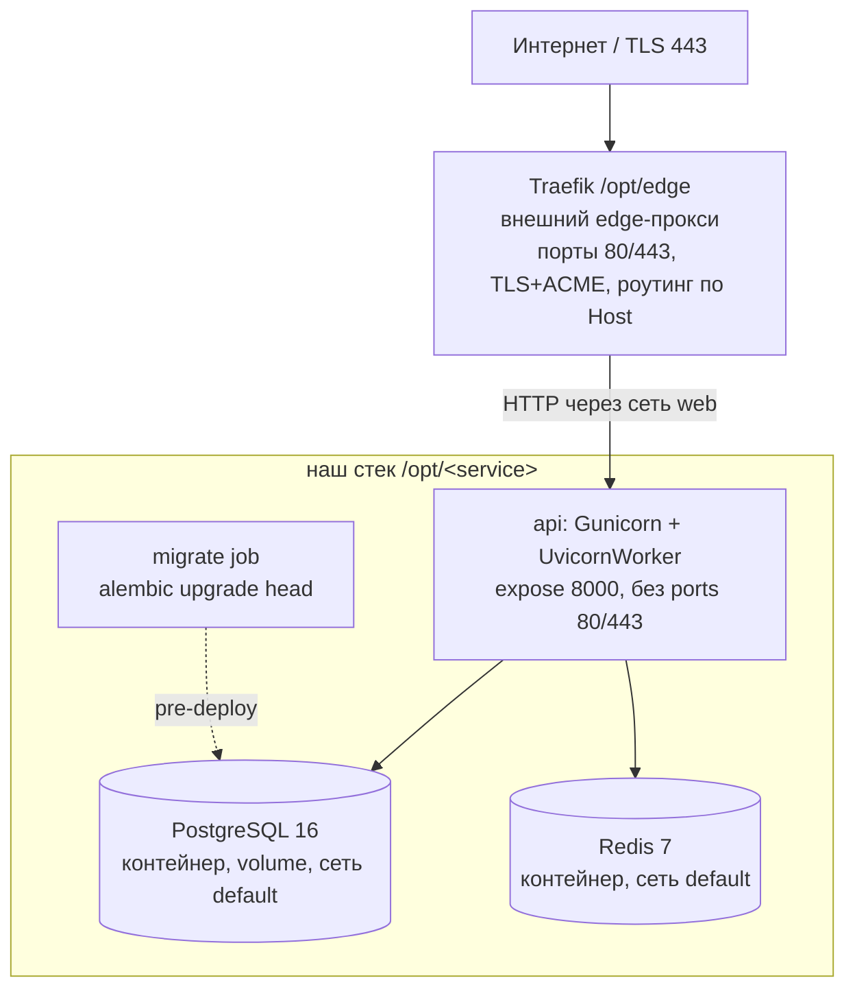

# 07 — Deployment

## Артефакт
Один Docker-образ (multi-stage, base `python:3.12-slim`), запускается через Gunicorn + UvicornWorker. Stateless — состояние в PostgreSQL/Redis. Образ **собирается на сервере** из исходников в `/opt/<service>` (явный `docker compose build api migrate`, затем `up -d --no-build` — см. [§Процедура деплоя](#процедура-деплоя-github-actions--ssh)), не пушится из registry ([ADR-017](adr/ADR-017-shared-server-traefik-deploy.md)).

> **Python 3.12 закреплён явно (воспроизводимость сборки).** Prod-образ пинит `python:3.12-slim-bookworm` (Dockerfile) — прод от проблемы выбора интерпретатора **не страдает**. Для **dev/CI** пин закреплён в исходниках: `pyproject.toml` `requires-python = ">=3.12,<3.13"` + `.python-version = 3.12`. Без верхней границы `uv` на чистой машине выбирал новейший Python (наблюдалось 3.14), где нет `cp3xx`-колёс `asyncpg` → `uv sync` падал на сборке из исходников (свидетельство — коммит `a30aa8c`). Явный пик 3.12 выравнивает dev/CI/prod и делает `uv sync` детерминированным (`uv.lock` + `cp312`-колёса). Обоснование и решение (TD не заводится — остаточного долга нет) — [02-tech-stack.md §Пин Python 3.12](02-tech-stack.md#язык-и-runtime).

## Топология MVP — общий сервер за внешним Traefik
Deploy-target зафиксирован ([ADR-017](adr/ADR-017-shared-server-traefik-deploy.md), решение владельца инфраструктуры 2026-06-02, ревизует [TD-005](100-known-tech-debt.md)): сервис размещается на **общем Linux-сервере** (Ubuntu 22.04, `87.239.135.154`, root), где уже работают другие сервисы (`music-backend`) и **общий edge-прокси Traefik** в `/opt/edge`. Наш сервис — каталог `/opt/<service>` (например `/opt/claude-ios`), встраивается в Traefik через docker-labels и внешнюю сеть `web`.



Состав нашего `docker compose`-стека в `/opt/<service>` (Traefik — **вне** нашего стека):
- **Traefik** — НЕ наш контейнер. Общий edge-прокси владельца сервера (`/opt/edge`): держит порты 80/443, терминирует TLS, авто-выпускает Let's Encrypt-сертификаты, роутит по доменам. Наш стек **не содержит** reverse-proxy и **не управляет** TLS/ACME.
- **api** — Docker-образ приложения (Gunicorn + UvicornWorker). `expose: 8000` (uvicorn/gunicorn), **без** `ports:` для 80/443 (конфликт с Traefik запрещён). Подключён к двум сетям: `web` (`external: true`, общая с Traefik) и `default` (внутренняя для PG/Redis). Снаружи доступен **только** через Traefik по сети `web`.
- **postgres** — PostgreSQL 16 в контейнере с persistent volume. **Только** в сети `default`, **без публикации портов** (бэкап — `pg_dump` по cron на хосте + offsite-копия).
- **redis** — Redis 7 в контейнере (rate limit, idempotency, policy cache). **Только** в сети `default`, **без публикации портов**.
- **migrate** — одноразовый job (`alembic upgrade head`), запускается до старта `api` при каждом релизе.
- Single-region, single-host (общий с другими сервисами). Состояние — в volume PostgreSQL + Redis; образ `api` — stateless.

> **Жёсткие требования к нашему `docker-compose` (от владельца сервера, [ADR-017](adr/ADR-017-shared-server-traefik-deploy.md)):**
> 1. НЕ публиковать порты 80/443 (никаких `ports: 80/443`) — иначе конфликт с Traefik. Только `expose` внутреннего `8000`.
> 2. `api` — в сети `web` (`external: true`, общая с Traefik) + `default` (внутренняя для PG/Redis).
> 3. Маршрут — через docker-labels (Traefik подхватит, см. ниже).
> 4. SSL/nginx/Caddy НЕ настраивать — TLS целиком Traefik. `postgres`/`redis` — только в `default`, без публикации портов.
> 5. Внешняя сеть `web` создаётся на сервере однократно: `docker network create web` (уже создана).
> 6. `DOCKER_MIN_API_VERSION=1.24` уже задан на сервере — не трогать.

> **PostgreSQL/Redis: контейнерные vs managed.** На MVP — контейнерные в том же стеке (минимум инфраструктуры). При росте нагрузки — вынос на managed без изменения контрактов приложения (`DATABASE_URL`/`REDIS_URL`). Бэкап контейнерного PG (`pg_dump` + offsite) **обязателен** до приёма реальных пользователей — см. prod-checklist.

### Маршрутизация через Traefik docker-labels
Traefik обнаруживает наш `api` через labels на сервисе `api` в `docker-compose`. Значения зафиксированы: `SERVICE_DOMAIN=broadnova.shop` ([Q-017-1](99-open-questions.md)), `TRAEFIK_CERTRESOLVER=le` ([Q-017-2](99-open-questions.md)):
```
traefik.enable=true
traefik.docker.network=web
traefik.http.routers.<service>.rule=Host(`${SERVICE_DOMAIN}`)
traefik.http.routers.<service>.entrypoints=websecure
traefik.http.routers.<service>.tls.certresolver=${TRAEFIK_CERTRESOLVER}   # опционален: le — default на websecure
traefik.http.services.<service>.loadbalancer.server.port=8000
```
- `${SERVICE_DOMAIN}` — домен сервиса = `broadnova.shop` ([Q-017-1](99-open-questions.md)); A-запись `broadnova.shop` → `87.239.135.154` **обязана существовать до запуска** (ACME-challenge Traefik).
- `${TRAEFIK_CERTRESOLVER}` — имя ACME-certresolver общего Traefik = `le` (`/opt/edge`, [Q-017-2](99-open-questions.md)). Владелец сервера сделал `le` **дефолтным** на entrypoint `websecure` (`--entrypoints.websecure.http.tls.certresolver=le`), поэтому этот label **опционален** — сертификат выпустится автоматически для любого HTTPS-роутера. Явный label `tls.certresolver=le` **рекомендован для надёжности** (детерминированность при изменении дефолта).
- `loadbalancer.server.port=8000` — Traefik проксирует на внутренний `8000` контейнера `api` по сети `web`.

### Биндинг и доступ
- `api` **не** публикует 80/443; снаружи доступен только через Traefik (сеть `web`). Прямой доступ из интернета к `api`/`postgres`/`redis` закрыт отсутствием публикации портов + изоляцией сетей.
- `TRUSTED_PROXY_IPS` в prod **обязан** содержать адрес/подсеть **Traefik** (docker-сеть `web`). Traefik проставляет `X-Forwarded-For`; без доверия к нему per-IP rate limit видит IP Traefik, а не клиента. См. [05-security.md](05-security.md#доверенный-reverse-proxy-и-определение-client-ip-anti-spoofing) и [§Конфигурация](#конфигурация-env).

## Reverse-proxy / LB — операционные требования к `/v1/preview/*`
Приложение отдаёт пользовательский (Claude-сгенерированный) HTML/JS на `GET /v1/preview/{projectId}/{token}/{path}` со **своими** sandbox-заголовками (ADR-010, [05-security.md](05-security.md#backend-hosted-preview-отдача-пользовательского-htmljs-adr-010)): `Content-Security-Policy: sandbox ...`, `X-Content-Type-Options: nosniff`, `X-Frame-Options: SAMEORIGIN`, `Cache-Control: private, no-store`, без cookies. Этот путь **исключён** из дефолтных security-заголовков middleware, чтобы отдать собственную политику.

Reverse-proxy / LB (в нашей схеме — **внешний Traefik**) **ОБЯЗАН** на `/v1/preview/*`:
- **не перетирать и не дублировать** заголовки ответа (`Content-Security-Policy`, `X-Frame-Options`, `X-Content-Type-Options`, `Cache-Control`) — pass-through as-is. Не навешивать глобальный `X-Frame-Options: DENY` / общий CSP, применяемый к остальным путям.
- **не добавлять `Set-Cookie`** и не инжектить session/affinity-cookies на этот префикс (превью открывается прямой ссылкой, авторизация — в signed URL, не в cookie).
- глобальные политики безопасности прокси для прочих путей (HSTS, `X-Frame-Options: DENY`) применять **в обход** `/v1/preview/*` (отдельный route/middleware без переопределения заголовков приложения).

> **Операционное требование к владельцу Traefik ([ADR-017](adr/ADR-017-shared-server-traefik-deploy.md)).** Reverse-proxy теперь — общий **внешний** Traefik (`/opt/edge`), вне нашего репозитория. Контракт pass-through выше — требование к его конфигурации Host-роутера нашего домена: не навешивать на `/v1/preview/*` глобальные header-/cookie-middleware Traefik, которые перетрут sandbox-заголовки приложения (ADR-010). По умолчанию Traefik **не** модифицирует заголовки ответа без явных middleware — требование сводится к «не добавлять header/cookie-middleware на роутер нашего домена для `/v1/preview/*`».

Прежние Caddy/nginx-артефакты (legacy, DEPRECATED: [`infra/legacy/Caddyfile`](../infra/legacy/Caddyfile), [`infra/legacy/nginx.conf.example`](../infra/legacy/nginx.conf.example)) в этой схеме **не используются** (TLS/reverse-proxy — внешний Traefik) — перенесены в `infra/legacy/` с DEPRECATED-баннером. См. [§Prod-артефакты](#prod-артефакты-источник-истины--реальные-файлы-в-репозитории).

**Изоляция origin (операционно, [Q-010-3](99-open-questions.md), не блокер):** старт — single-origin `/v1/preview/*` + sandbox-заголовки (самодостаточно). Prod-рекомендация — вынести превью на отдельный поддомен `preview.<domain>`, чтобы даже при обходе CSP пользовательский JS не имел same-origin доступа к API. При вводе поддомена то же требование pass-through заголовков и запрет cookies сохраняется.

## Конфигурация (env)
| Переменная | Назначение |
|---|---|
| `DATABASE_URL` | `postgresql+asyncpg://<POSTGRES_USER>:<POSTGRES_PASSWORD>@postgres:5432/<POSTGRES_DB>` — **собирается из `POSTGRES_USER`/`POSTGRES_PASSWORD`/`POSTGRES_DB` целиком**; все три должны совпадать со значением URL. На клоне — свои значения (см. [clone `.env`-контракт](#clone-env-контракт-ключи-claude-ios)). |
| `POSTGRES_USER` / `POSTGRES_DB` / `POSTGRES_PASSWORD` | креды контейнерного PostgreSQL. `POSTGRES_PASSWORD` — **секрет** (secret manager). Входят в `DATABASE_URL` целиком. На клоне — свои. |
| `KMS_KEY_ID` | идентификатор облачного KMS-ключа. **На MVP пуст** — используется `LocalKmsClient` (in-process AES-256-GCM под `KMS_LOCAL_MASTER_KEY`, облачного KMS нет, [Q-002-1](99-open-questions.md), [ADR-003](adr/ADR-003-byok-envelope-encryption.md)). Заполняется только при миграции на облачный KMS (post-MVP). |
| `REDIS_URL` | `redis://...` |
| `LLM_PROVIDER` | **(провайдер-абстракция, [ADR-033](adr/ADR-033-llm-provider-abstraction.md))** выбор **сервисного** (credits-режим) LLM-провайдера: `anthropic` \| `openai`. **Кодовый дефолт `anthropic`** = текущее поведение (инстансы `claude-ios`/`avelyra` не задают → no-op). На OpenAI-инстансе — `openai` + `OPENAI_API_KEY` (нужен для режимов [ADR-055](adr/ADR-055-dialog-mode.md)). Public, не секрет. Per-instance. **⚠️ Смена дефолта на OpenAI ([ADR-059](adr/ADR-059-openai-default-provider.md)) делается ТОЛЬКО через этот env, НЕ сменой кодового дефолта.** Поэтому **существующие anthropic-инстансы, полагавшиеся на дефолт, ОБЯЗАНЫ явно задать `LLM_PROVIDER=anthropic`** — иначе будущая смена кодового дефолта молча переключит их на OpenAI (нет `OPENAI_API_KEY`, чужой wire-формат в БД → падение). Проверяемое допущение ([ADR-059 §5,§8](adr/ADR-059-openai-default-provider.md)): OpenAI-сессий со старым Chat Completions payload в проде быть не должно (прод на anthropic) — подтвердить до мержа Responses-перехода. **BYOK ([ADR-044](adr/ADR-044-multi-provider-byok.md)) НЕ зависит от этой переменной** — провайдер byok-ключа определяется по самому ключу. **При смене** `anthropic`→`openai`: задать `OPENAI_API_KEY`; существующие чаты со старой моделью продолжатся на новом дефолте (stale-model фолбэк, [ADR-044 §Связанное](adr/ADR-044-multi-provider-byok.md)) — не падают. Новые режимы (`deep_thinking`/`study_learn`/`search`) активны только при `openai`. |
| `ANTHROPIC_API_KEY` | сервисный ключ Claude (mode=credits, **anthropic-инстансы**) |
| `ANTHROPIC_MODEL` | дефолтная модель Claude (= модель по умолчанию для выбора, помечается `default:true` в `GET /v1/models`) |
| `ANTHROPIC_MODELS` | **(выбор модели, [ADR-034](adr/ADR-034-user-model-selection.md))** allowlist моделей Claude для `GET /v1/models` / `chat.model`. JSON-объект `{ "<model-id>": "<displayName>" }` (по образцу `TOKEN_PRODUCTS`). Применяется при `LLM_PROVIDER=anthropic`. **Пусто/невалидно/не задан → фолбэк** на единственную модель `ANTHROPIC_MODEL` (обратная совместимость). Public, не секрет. Per-instance. Пример: `{"claude-sonnet-4-5":"Claude Sonnet 4.5","claude-opus-4-1":"Claude Opus 4.1"}`. |
| `OPENAI_API_KEY` | **(OpenAI, [ADR-033](adr/ADR-033-llm-provider-abstraction.md))** сервисный ключ OpenAI (mode=credits). **СЕКРЕТ**, secret manager, под redaction (покрыт денилистом `key`). Обязателен при `LLM_PROVIDER=openai`. Per-instance (не делить между инстансами). **⚠️ Дополнительная роль — key-gate генерации изображений ([ADR-058 §3](adr/ADR-058-image-generation.md)):** инструмент `image.generate` предлагается модели **тогда и только тогда, когда `OPENAI_API_KEY` задан**, **независимо от `LLM_PROVIDER`** (отдельный `AsyncOpenAI`-клиент, не часть провайдер-абстракции ADR-033). Поэтому на **Anthropic-инстансе** (broadnova/avelyra) заданный `OPENAI_API_KEY` **включает генерацию изображений** — здесь он **не про чат** (чат остаётся на `ANTHROPIC_*`), а именно про изображения. Пустой ключ → `image.generate` не предлагается и весь блок `IMAGE_*` неактивен. |
| `OPENAI_MODEL` | **(OpenAI)** дефолтная модель оркестрации, дефолт **`gpt-4o`**. Chat Completions API, non-streaming. (= модель по умолчанию для выбора, `default:true` в `GET /v1/models` на openai-инстансе). |
| `OPENAI_MODELS` | **(выбор модели, [ADR-034](adr/ADR-034-user-model-selection.md))** allowlist моделей OpenAI для `GET /v1/models` / `chat.model`. JSON-объект `{ "<model-id>": "<displayName>" }`. Применяется при `LLM_PROVIDER=openai`. **Пусто/невалидно/не задан → фолбэк** на единственную модель `OPENAI_MODEL` (обратная совместимость). Public, не секрет. Per-instance. Пример: `{"gpt-4o":"GPT-4o","gpt-4o-mini":"GPT-4o mini"}`. |
| `OPENAI_MAX_TOKENS` | **(OpenAI)** output-бюджет на вызов, дефолт `16000` (паритет с `ANTHROPIC_MAX_TOKENS`). |
| `OPENAI_TIMEOUT_SECONDS` | **(OpenAI)** таймаут upstream-вызова, дефолт `120`. |
| `OPENAI_MAX_RETRIES` | **(OpenAI)** число ретраев SDK, дефолт `2`. |
| `OPENAI_BYOK_DEFAULT_MODEL` | **(OpenAI)** активная модель в BYOK-ответе (`activeModel`) и модель byok-генерации для **OpenAI BYOK-ключа** при `keyStatus=valid`, дефолт `gpt-4o` ([ADR-016](adr/ADR-016-extended-byok-statuses.md)/[ADR-033](adr/ADR-033-llm-provider-abstraction.md)/[ADR-044](adr/ADR-044-multi-provider-byok.md)). Отдельно от anthropic `BYOK_DEFAULT_MODEL`. **Применяется к OpenAI-ключу на ЛЮБОМ инстансе** (мульти-провайдерный BYOK), поэтому имеет смысл задавать и на anthropic-инстансах, где клиенты могут приносить OpenAI-ключи. |
| `DEEP_THINKING_MODEL` | **(режим Deep Thinking, [ADR-055](adr/ADR-055-dialog-mode.md)/[ADR-059](adr/ADR-059-openai-default-provider.md))** reasoning-модель, которую форсит `dialogMode=deep_thinking`, **переопределяя** `chat.model` и stale-guard (включая BYOK — ключ юзера тратится на эту модель). Применяется на OpenAI-инстансах. Public, не секрет. Per-instance. |
| `DEEP_THINKING_EFFORT` | **(Deep Thinking)** уровень рассуждения `reasoning.effort` ∈ `low`\|`medium`\|`high`. Malformed → безопасный дефолт (стиль `resolved_*`, напр. `medium`). |
| `DEEP_THINKING_TIMEOUT_SECONDS` | **(Deep Thinking)** таймаут upstream-вызова reasoning-хода (обычно > `OPENAI_TIMEOUT_SECONDS` — reasoning дольше). Целое > 0. |
| `OPENAI_SEARCH_CONTEXT_SIZE` | **(режим Search, [ADR-055](adr/ADR-055-dialog-mode.md)/[ADR-059](adr/ADR-059-openai-default-provider.md))** `search_context_size` встроенного tool `web_search` ∈ `low`\|`medium`\|`high`. Malformed → безопасный дефолт. Public. |
| `IMAGE_CREDITS_COST` | **(генерация изображений, [ADR-058 §4](adr/ADR-058-image-generation.md))** число кредитов за одно сгенерированное изображение — **отдельный дебет** сверх биллинга хода. **Списывается независимо от `mode` — и `credits`, и `byok`** (изображение генерируется на серверном `OPENAI_API_KEY`; BYOK покрывает только текст). Итог: `credits` → `1 + N×IMAGE_CREDITS_COST`, `byok` → `N×IMAGE_CREDITS_COST`. Trial: текст бесплатен, изображение требует ненулевого баланса. Целое ≥ 0. Public. |
| `IMAGE_MODEL` | **(изображения)** модель генерации, дефолт `gpt-image-1`. Активна при заданном `OPENAI_API_KEY` (key-gate, [ADR-058 §3](adr/ADR-058-image-generation.md)) — **независимо от `LLM_PROVIDER`**, поэтому работает и на Anthropic-инстансе с заданным `OPENAI_API_KEY` (см. строку `OPENAI_API_KEY` выше). |
| `IMAGE_DEFAULT_SIZE` | **(изображения)** размер по умолчанию (`auto`/`1024x1024`/`1536x1024`/`1024x1536`/…). Malformed → безопасный дефолт. |
| `IMAGE_DEFAULT_QUALITY` | **(изображения)** качество по умолчанию (`auto`/`low`/`medium`/`high`/`standard`/`hd`). Malformed → безопасный дефолт. |
| `IMAGE_OUTPUT_FORMAT` | **(изображения, [ADR-058 §3](adr/ADR-058-image-generation.md))** формат выходного файла: `png`\|`jpeg`\|`webp`. Дефолт **`png`**. Malformed → безопасный дефолт (`png`). |
| `IMAGE_TIMEOUT_SECONDS` | **(изображения)** таймаут отдельного `images.generate`-клиента, целое > 0. |
| `IMAGE_MAX_RETRIES` | **(изображения)** число ретраев SDK для `images.generate`, целое ≥ 0. |
| `IMAGE_MAX_BYTES` | **(изображения, [ADR-058 §3](adr/ADR-058-image-generation.md))** верхний предел размера декодированного изображения (защита памяти/хранилища). Больше → `ImageGenerationError` (ход деградирует в tool_result-ошибку, байты не сохраняются). Целое > 0, дефолт **`16777216`** (16 MiB). |
| `TEMPORARY_IMAGE_TTL_SECONDS` | **(изображения временного чата, [ADR-058 §6](adr/ADR-058-image-generation.md)/[ADR-056](adr/ADR-056-temporary-chat.md))** TTL изображений, сгенерированных во **временном** чате: `expires_at = created_at + N`. Дефолт **`86400`** (24 ч). Обычный чат → `expires_at=NULL` (не истекает). Истёкшее → `GET /v1/images/{id}` `404` (логически, по `expires_at`). Malformed → безопасный дефолт. |
| `IMAGE_SWEEP_BATCH_SIZE` | **(изображения, [ADR-058 §6](adr/ADR-058-image-generation.md))** размер партии opportunistic sweep истёкших изображений (`DELETE ... LIMIT N`). Целое > 0; малый (напр. `50`), чтобы не бить по latency. |
| `IMAGE_SWEEP_MIN_INTERVAL_SECONDS` | **(изображения, [ADR-058 §6](adr/ADR-058-image-generation.md))** троттлинг sweep: не чаще раза в N секунд (Redis-ключ с TTL + лок). Без планировщика физический sweep — best-effort ([TD-036](100-known-tech-debt.md)); логическая недоступность истёкших изображений безусловна. Целое > 0. |
| `ANTHROPIC_MAX_TOKENS` | output-бюджет на вызов, дефолт **`16000`** ([ADR-025](adr/ADR-025-parallel-tool-calls-and-max-tokens-truncation.md)); прежний `4096` обрезал генерацию кода/файлов. Non-streaming. **Per-instance** — задать на каждом инстансе. |
| `ANTHROPIC_TIMEOUT_SECONDS` | таймаут upstream-вызова, дефолт **`120`** ([ADR-025](adr/ADR-025-parallel-tool-calls-and-max-tokens-truncation.md), поднят с 60 под длинную генерацию при `max_tokens=16000`). |
| `JWT_ISSUER` / `JWT_AUDIENCE` | issuer/audience выпускаемых и проверяемых JWT. Для встроенного issuer: `JWT_ISSUER=https://broadnova.shop`, `JWT_AUDIENCE=claude-ios` ([ADR-018](adr/ADR-018-embedded-auth-issuer.md)). |
| `JWT_PRIVATE_KEY` / `JWT_PRIVATE_KEY_PATH` | **СЕКРЕТ** — приватный RS256-ключ подписи (встроенный issuer). PEM-строка с `\n`-экранированием **или** путь к файлу (приоритет у `*_PATH`). Только secret manager / mounted-файл, под redaction. **Должен быть сконфигурирован до публичного запуска** (без него `/v1/auth/*` → `503`). [Q-005-1](99-open-questions.md) Closed ([ADR-018](adr/ADR-018-embedded-auth-issuer.md)). |
| `JWT_PUBLIC_KEY` / `JWT_PUBLIC_KEY_PATH` | публичный RS256-ключ (verify + `/v1/auth/jwks`). PEM-строка (`\n`-экранирование) или файл-путь. Не секрет. |
| `JWT_KID` | идентификатор ключа (`kid` в заголовке JWT / JWKS); задел под ротацию. |
| `JWT_JWKS_URL` | **опционально** — verify-only режим внешнего issuer (Firebase и т.п.). Для встроенного issuer не используется (verify по `JWT_PUBLIC_KEY`). Sign in with Apple реализован **не** через этот режим — см. `APPLE_*` ниже ([ADR-043](adr/ADR-043-sign-in-with-apple.md)). |
| `AUTH_ACCESS_TTL_SECONDS` / `AUTH_REFRESH_TTL_SECONDS` | TTL access-token (дефолт `3600`) / refresh-token (дефолт `2592000`). [ADR-018](adr/ADR-018-embedded-auth-issuer.md). |
| `AUTH_RATE_LIMIT_PER_IP` / `AUTH_JWKS_ENABLED` | rate-limit `/v1/auth/*` per IP (дефолт `10`/min) / видимость `GET /v1/auth/jwks` (дефолт `true`). |
| `KMS_LOCAL_MASTER_KEY` | мастер-ключ для envelope encryption BYOK на MVP (`LocalKmsClient`, реальный AES-256-GCM wrap DEK, [ADR-003](adr/ADR-003-byok-envelope-encryption.md)). Высокоэнтропийный (32 байта base64), **только через secret manager/env на сервере** (`.env` в `/opt/<service>`), под redaction. Миграция на облачный KMS — post-MVP ([Q-002-1](99-open-questions.md)). |
| `APPSTORE_*` | App Store Server API credentials (`APPSTORE_ENVIRONMENT`/`APPSTORE_BUNDLE_ID`/`APPSTORE_ROOT_CERT_DIR`) |
| `APPLE_OIDC_ISSUER` | **(Sign in with Apple, [ADR-043](adr/ADR-043-sign-in-with-apple.md))** ожидаемый `iss` Apple identity token. Дефолт `https://appleid.apple.com`. Не секрет. |
| `APPLE_JWKS_URL` | **(Apple)** JWKS Apple для верификации RS256-подписи. Дефолт `https://appleid.apple.com/auth/keys`. Кэш — общий `JWT_JWKS_CACHE_TTL` (300с). Не секрет. |
| `APPLE_AUDIENCE` | **(Apple)** ожидаемый `aud` = **bundle id** приложения (нативный Sign in with Apple). **Per-instance** = реальный bundle (broadnova `com.lor.5075claude` / avelyra `com.nad.5112claude` / orvianix `com.ari.5108codex`). Пусто → фолбэк на `APPSTORE_BUNDLE_ID`. Оба пусты → `POST /v1/auth/apple` → `503` (not configured). Не секрет. |
| `APPLE_TEST_MODE` | **(Apple)** env-флаг HS256 test-mode для герметичных тестов (образец `STOREKIT_TEST_MODE`). Дефолт `false` (**prod fail-closed**: HS256-токен вне test-mode → `401`). **В prod не включать.** |
| `APPLE_TEST_SECRET` | **(Apple)** общий секрет (HS256) для тестового Apple-токена. Обязателен при `APPLE_TEST_MODE=true` (пусто → test-mode не активируется). Секрет, под redaction. **В prod не задаётся.** |
| `STOREKIT_TEST_MODE` | env-флаг тестовой верификации StoreKit. Дефолт `false` (**prod fail-closed, реальная JWS-верификация**). `true` — принимает HS256-тестовую транзакцию (только e2e/CI). При `true` — WARNING в лог на старте. См. [09-e2e-testing.md §2](09-e2e-testing.md#2-storekit_test_mode--env-gated-режим-тестовой-верификации), [TD-007](100-known-tech-debt.md). |
| `STOREKIT_TEST_SECRET` | общий секрет (HS256) для тестовых транзакций. Обязателен при `STOREKIT_TEST_MODE=true` (пусто → test-mode не активируется). Секрет, под redaction. **В prod не задаётся.** |
| `STOREKIT_TRUST_ANY_XCODE_CERT` | env-флаг доверия ЛЮБОМУ самоподписанному серту локального **Xcode StoreKit Testing** (CN `StoreKit Testing in Xcode`) на **ES256-пути** верификации. Дефолт `false` (**prod fail-closed, заякоривание до Apple root CA**). `true` — принимает такой серт без anchor-проверки (ES256-подпись листа всё равно проверяется), **только для пред-релизного тестового инстанса**. При `true` — WARNING в лог на старте. **В prod = `false` (ОТКЛЮЧИТЬ перед запуском).** См. [ADR-061](adr/ADR-061-storekit-trust-any-xcode-cert.md), [TD-039](100-known-tech-debt.md). |
| `SUBSCRIPTION_CREDITS_PER_PERIOD` | кредитов на период подписки (grant), дефолт `1000` (ADR-006) |
| `PRESETS_DEFAULT_LOCALE` | **(локализация пресетов, [ADR-049](adr/ADR-049-presets-localization.md))** язык каталога `GET /v1/presets` по умолчанию для инстанса. Набор — поддерживаемые локали (`en`, `ru`). Дефолт `en` = текущее поведение. **Per-instance:** `avelyra=ru` (русскоязычный инстанс), остальные (`claude-ios`/`orvianix`/`veltrio`) не задают (= `en`). Public, не секрет. Значение вне набора → graceful fallback `en` + WARNING в лог (не роняет старт). Клиент может переопределить per-request через `?locale=`/`Accept-Language` ([02-api-contracts](modules/chat-orchestrator/02-api-contracts.md#get-v1presets--пресеты-промтов-adr-035)). Пусто/не задан → `en` (обратная совместимость). |
| `ADMIN_API_SECRET` | изолированный admin-секрет для `X-Admin-Token` (`/v1/admin/*`). Высокоэнтропийный, secret manager. Под redaction. Не задан → admin-API недоступен (всегда `401`). См. [ADR-009](adr/ADR-009-admin-token-auth.md). |
| `ADMIN_API_SECRET_PREV` | предыдущий admin-секрет на grace-период ротации (опц.). Пусто вне ротации. Под redaction. |
| `ADMIN_RATE_LIMIT_PER_MIN` | rate limit `/v1/admin/*` per source IP, дефолт `10`. |
| `PREVIEW_URL_SECRET` | секрет HMAC для preview signed URL (`/v1/preview/*`). Высокоэнтропийный, secret manager, отдельный от прочих. Под redaction. См. [ADR-010](adr/ADR-010-backend-hosted-preview.md). |
| `PREVIEW_URL_TTL_SECONDS` | TTL preview signed URL, дефолт `900` (15 мин). |
| `PREVIEW_MAX_FILE_BYTES` | лимит размера одного файла сайта, дефолт `1048576` (1 MB). |
| `PREVIEW_MAX_PROJECT_BYTES` | лимит суммарного размера проекта, дефолт `10485760` (10 MB). |
| `PREVIEW_MAX_FILES` | лимит числа файлов в проекте, дефолт `200`. |
| `MAX_SERVER_TOOL_ROUNDS` | guard числа последовательных server-side (`site.*`) tool-раундов на message-шаг, дефолт `16` ([ADR-011](adr/ADR-011-server-side-tools.md)). |
| `TOKEN_PRODUCTS` | маппинг consumable-продуктов `productId→credits` (JSON), напр. `{"tokens_1500":1500,"tokens_600":600,"tokens_250":250,"tokens_100":100}`. Источник числа кредитов на покупку токенов (server-side, [ADR-015](adr/ADR-015-consumable-token-iap.md)). |
| `ADAPTY_WEBHOOK_SECRET` | **(Adapty, [ADR-029](adr/ADR-029-adapty-subscription-webhook.md))** статический bearer-секрет для `POST /v1/billing/adapty/webhook` (`Authorization: Bearer <...>`). Высокоэнтропийный (≥ 32 байта), secret manager, **per-instance** (свой на каждый инстанс), отдельный от прочих. Под redaction. **Не задан → эндпоинт `500`** (мис-конфигурация). Задаётся также оператором в **Adapty UI** при настройке вебхука (то же значение). |
| `ADAPTY_PRODUCT_TOKENS` | **(Adapty)** маппинг `vendor_product_id→tokens` (JSON), напр. `{"sub_monthly":1000,"sub_yearly":1000}`. Источник числа кредитов на грант по событию подписки ([ADR-029](adr/ADR-029-adapty-subscription-webhook.md)). Дефолт `{}` (всё идёт через fallback). |
| `ADAPTY_SUBSCRIPTION_TOKENS_GRANT` | **(Adapty)** fallback-число кредитов на грант, если `vendor_product_id` отсутствует в `ADAPTY_PRODUCT_TOKENS`. Целое > 0, дефолт `1000` ([ADR-029](adr/ADR-029-adapty-subscription-webhook.md)). Отдельно от `SUBSCRIPTION_CREDITS_PER_PERIOD` (StoreKit-путь) для независимой калибровки. |
| `CLOUDPAYMENTS_WEBHOOK_TOKEN` | **(broadapps RU-путь, [ADR-050](adr/ADR-050-cloudpayments-webhook.md) → ЛЕГАСИ [ADR-054](adr/ADR-054-cloudpayments-webhook-payment-verification.md))** статический bearer-секрет вебхука. **[ADR-054](adr/ADR-054-cloudpayments-webhook-payment-verification.md): больше НЕ гейтит и НЕ требуется** (broadapps шлёт колбэк без авторизации; гейт активации переехал на `CLOUDPAYMENTS_API_TOKEN`). Опционален; если задан — используется лишь для поля `matched` наблюдательного лога. Под redaction. Можно не задавать. |
| `CLOUDPAYMENTS_API_TOKEN` (RU webhook+checkout) | **([ADR-054](adr/ADR-054-cloudpayments-webhook-payment-verification.md))** ТЕПЕРЬ гейтит **и вебхук** (верификация `GET /users/{deviceId}/payments`): пуст → вебхук `500` misconfigured ⇒ начисляет **только на avelyra**. Bearer НАШИХ исходящих вызовов К broadapps (см. также [ADR-051](adr/ADR-051-cloudpayments-checkout-payment-link.md), секреты-таблица ниже). |
| `CLOUDPAYMENTS_PAID_STATUSES` | **(broadapps верификация, [ADR-054](adr/ADR-054-cloudpayments-webhook-payment-verification.md))** набор `status`, трактуемых как «оплачено», CSV/JSON, сравнение lower-case. **Дефолт `succeeded`** (подтверждено реальным ответом broadapps). Расширять при необходимости (`succeeded,paid,completed,confirmed`); фактический `status` логируется ([Q-054-1](99-open-questions.md)). |
| `CLOUDPAYMENTS_PAYMENT_FRESHNESS_HOURS` | **(broadapps верификация, [ADR-054](adr/ADR-054-cloudpayments-webhook-payment-verification.md))** окно свежести: реконсиляция начисляет только платежи с `paid_at ≥ now-N ч`. Целое > 0, **дефолт `72`**. Отсекает начисление старой истории на первом колбэке; слишком узкое → пропуск при долгой недоступности broadapps ([Q-054-2](99-open-questions.md)). |
| `CLOUDPAYMENTS_WEBHOOK_RATE_LIMIT_PER_IP` | **(broadapps публичный вебхук, [ADR-054](adr/ADR-054-cloudpayments-webhook-payment-verification.md))** per-source-IP лимит `/v1/billing/cloudpayments/webhook` (эндпоинт публичный). Целое > 0, **дефолт `120`**/мин (щедро — легитимные колбэки не задевает; анти-амплификация исходящих `GET`). Превышение → `429`. |
| `CLOUDPAYMENTS_PRODUCT_TOKENS` | **(broadapps)** маппинг **`product.code`**→tokens тиров подписки (JSON), напр. `{"yearly_49.99_nottrial":12000,"week_6.99_nottrial":1000}`. Источник числа кредитов на грант подписки RU-пути ([ADR-050](adr/ADR-050-cloudpayments-webhook.md); ключ = `product.code` из verify, [ADR-054](adr/ADR-054-cloudpayments-webhook-payment-verification.md)). Дефолт `{}` (всё через fallback). Token-пакеты берут число из `TOKEN_PRODUCTS`, не отсюда. |
| `CLOUDPAYMENTS_SUBSCRIPTION_TOKENS_GRANT` | **(broadapps)** fallback-число кредитов на грант подписки, если `product.code` отсутствует в `CLOUDPAYMENTS_PRODUCT_TOKENS`. Целое > 0, дефолт `1000` ([ADR-050](adr/ADR-050-cloudpayments-webhook.md)). Независимая калибровка RU-пути. |
| `BYOK_DEFAULT_MODEL` | активная модель (`activeModel`) и модель byok-генерации для **Anthropic BYOK-ключа** при `keyStatus=valid`, напр. `claude-sonnet-4-6` ([ADR-016](adr/ADR-016-extended-byok-statuses.md)/[ADR-044](adr/ADR-044-multi-provider-byok.md)). **Применяется к Anthropic-ключу на ЛЮБОМ инстансе** (мульти-провайдерный BYOK), поэтому имеет смысл задавать и на OpenAI-инстансах, где клиенты приносят Anthropic-ключи. |
| `ATTACHMENT_MAX_BYTES_IMAGE` | лимит размера одного image-вложения inline base64, дефолт `5242880` (5 MB) ([ADR-020](adr/ADR-020-inline-base64-attachments-mvp.md)). |
| `ATTACHMENT_MAX_BYTES_DOCUMENT` | лимит размера одного document-вложения inline base64, дефолт `8388608` (8 MB) ([ADR-020](adr/ADR-020-inline-base64-attachments-mvp.md)). |
| `ATTACHMENT_TOTAL_BYTES` | суммарный лимит размера вложений в одном запросе, дефолт `10485760` (10 MB) ([ADR-020](adr/ADR-020-inline-base64-attachments-mvp.md)). |
| `ATTACHMENT_MAX_COUNT` | макс. число вложений на сообщение, дефолт `10` ([ADR-020](adr/ADR-020-inline-base64-attachments-mvp.md)). |
| `ATTACHMENT_PDF_MAX_PAGES` | guard числа страниц PDF (анти-decompression-bomb, `pypdf`), дефолт `100` ([ADR-020](adr/ADR-020-inline-base64-attachments-mvp.md)). |
| `ATTACHMENT_REQUEST_BODY_LIMIT` | повышенный transport-лимит тела для роута `/v1/chat/run` под inline base64, дефолт `12582912` (12 MB) ([ADR-020](adr/ADR-020-inline-base64-attachments-mvp.md), [05-security.md](05-security.md#повышенный-transport-лимит-для-v1chatrun-inline-base64-вложения-adr-020)). |
| `ATTACHMENT_EXTRACT_MAX_CHARS`, `ATTACHMENT_ORPHAN_TTL` | **не задаются на MVP** — относятся к отложенной двухшаговой upload-модели attachments ([TD-015](100-known-tech-debt.md), транспорт [ADR-014](adr/ADR-014-multimodal-attachments.md) Superseded). Orphan-очистка — [TD-010](100-known-tech-debt.md). |
| `WORKSPACE_CONTEXT_MAX_CHARS` | лимит суммарного контекста workspace-файлов, инжектируемого в prompt, дефолт `200000` ([ADR-013](adr/ADR-013-workspace-projects-vs-website-builder.md), [Q-013-1](99-open-questions.md)). |
| `CHAT_TITLE_MAX_CHARS` | макс. длина автогенерируемого заголовка чата, дефолт `60` (модуль chats). |
| `APNS_*` | credentials APNs для отправки push (`APNS_KEY_ID`/`APNS_TEAM_ID`/`APNS_AUTH_KEY`/`APNS_TOPIC`). **Не задаются в этом проходе** — отправка push отложена ([TD-011](100-known-tech-debt.md)). |
| `RATE_LIMIT_*` | значения rate limits |
| `SIZE_LIMIT_*` | size-лимиты payload |
| `TRUSTED_PROXY_IPS` | comma-separated список IP/CIDR доверенных reverse-proxy/LB. Дефолт `""` → XFF/X-Real-IP не доверяются, используется socket peer IP. **В prod ОБЯЗАН** содержать адрес/подсеть **внешнего Traefik** — подсеть docker-сети `web` (через неё Traefik проксирует на `api`). Иначе `client_ip` берётся как IP Traefik, и per-IP rate limit неработоспособен ([ADR-017](adr/ADR-017-shared-server-traefik-deploy.md), [05-security.md](05-security.md#доверенный-reverse-proxy-и-определение-client-ip-anti-spoofing)). Подсеть `web` — `docker network inspect web` (поле `IPAM.Config.Subnet`) на сервере; для bridge-сети по умолчанию вида `172.x.0.0/16`. |
| `TRUSTED_PROXY_HOP_COUNT` | число доверенных proxy-хопов перед приложением (chained LB/CDN). Дефолт `1`. Client IP берётся `(hop_count + 1)`-м справа из `X-Forwarded-For`. |
| `DB_POOL_SIZE` | размер пула соединений БД на процесс. Дефолт `10`. |
| `DB_MAX_OVERFLOW` | доп. соединения сверх `DB_POOL_SIZE` под пик. Дефолт `5`. |
| `DB_POOL_TIMEOUT` | таймаут ожидания соединения из пула, сек. Дефолт `30`. |
| `DB_POOL_RECYCLE` | принудительный recycle соединения, сек (борьба с idle-timeout на стороне PG/proxy). Дефолт `1800`. |
| `METRICS_SCRAPE_TOKEN` | если задан — `GET /metrics` требует заголовок `X-Scrape-Token` с этим значением (иначе 403). Пусто → endpoint открыт, защищать сетевой политикой. |
| `COMPOSE_PROJECT_NAME` | **(мульти-инстанс, [ADR-017](adr/ADR-017-shared-server-traefik-deploy.md) §Мульти-инстанс)** имя docker-compose project = инстанс-префикс. Подставляется как `${COMPOSE_PROJECT_NAME:-claude-ios}` в image-теги (`<proj>-backend:prod`) и Traefik router/service-имена (`routers.<proj>`/`services.<proj>`). **Дефолт `claude-ios`** = текущее захардкоженное значение (инвариант обратной совместимости). На живом broadnova.shop **не задаётся** (= no-op). На клоне — имя инстанса (напр. `avelyra`), и деплой выполняется с `-p <proj>`. Public, не секрет. См. [§Мульти-инстанс](#мульти-инстанс--клонирование-сервиса). |
| `SERVICE_DOMAIN` | домен сервиса. **Две роли:** (1) Traefik Host-роутер (label `Host(`broadnova.shop`)`) + ACME-сертификат ([ADR-017](adr/ADR-017-shared-server-traefik-deploy.md)); (2) **с [ADR-031](adr/ADR-031-absolute-preview-url.md) читается и самим приложением** (`config.py` `service_domain`) для построения **абсолютного** preview-URL в `site.preview` (`https://<SERVICE_DOMAIN>/v1/preview/...`). Значение нормализуется приложением (срез протокола/хвостового слеша). **Значение для живого инстанса: `broadnova.shop`** ([Q-017-1](99-open-questions.md)); A-запись → `87.239.135.154` до запуска. **На клоне — домен клона** (напр. `avelyraweb.shop`, [§Мульти-инстанс](#мульти-инстанс--клонирование-сервиса)). **Уже задан в `.env` обоих прод-инстансов** (для Traefik) — фикс ADR-031 подхватится после деплоя без изменения prod-env. Пусто (локальная разработка) → `site.preview` отдаёт относительный путь (fallback). TLS/ACME по-прежнему выпускает внешний Traefik, не приложение. PUBLIC, не секрет. |
| `TRAEFIK_CERTRESOLVER` | имя ACME-certresolver общего Traefik для label `tls.certresolver`. **Значение: `le`** (`/opt/edge`, [Q-017-2](99-open-questions.md)). `le` — **default на entrypoint `websecure`**, поэтому label опционален (сертификат выпускается автоматически), но явное указание рекомендовано для надёжности. TLS/ACME выпускает внешний Traefik, не приложение ([ADR-017](adr/ADR-017-shared-server-traefik-deploy.md)). |
| `OTEL_EXPORTER_OTLP_ENDPOINT` | трейсы |
| `LOG_LEVEL` | уровень логирования |
| `DOCS_ENABLED` | вкл/выкл OpenAPI-документацию (`/docs`, `/redoc`, `/openapi.json`). Дефолт `true` (dev/CI/staging). В prod рекомендуется `false` — не раскрывать схему API публично; при `false` эти пути отдают `404`. См. [08-api-documentation.md](08-api-documentation.md#r7-доступность-docs-в-prod-env-флаг). |

Все секреты — из secret manager, не из plaintext `.env` в prod.

### Sizing пула соединений БД
Эффективное число коннектов к PostgreSQL: `(DB_POOL_SIZE + DB_MAX_OVERFLOW) * workers * replicas`.
Это значение **обязано** оставаться ниже `max_connections` PostgreSQL (с запасом на служебные/админ-сессии).

Пример для MVP (один контейнер `api`, Gunicorn `-w 4`, 1 реплика, дефолты пула):
`(10 + 5) * 4 * 1 = 60` коннектов. Контейнерный PostgreSQL по умолчанию `max_connections = 100` — запас достаточный. При увеличении воркеров/реплик пересчитать:
- Формула: `(DB_POOL_SIZE + DB_MAX_OVERFLOW) * workers * replicas < Postgres max_connections` (с запасом на админ-/служебные сессии).
- Либо снизить `DB_POOL_SIZE`/`workers`, либо поднять `max_connections` PostgreSQL, либо вынести пуллинг на PgBouncer (transaction mode).
- `DB_MAX_OVERFLOW` — буфер под кратковременные пики, не постоянная ёмкость; держать малым.
Калибровать под фактический `max_connections` инстанса до prod-выката (см. prod-checklist).

## Локальный подъём и e2e-override
Локальный/single-host стек — `docker-compose.yml` (postgres + redis + migrate + api). Базовый compose публикует `postgres`/`redis` на `127.0.0.1:5432`/`6379`.

Для e2e/локального прогона на хостах, где порты 5432/6379 уже заняты нативными сервисами, есть отдельный override `docker-compose.e2e.yml`:

```
docker compose -f docker-compose.yml -f docker-compose.e2e.yml up -d
```

- `docker-compose.e2e.yml` снимает публикацию хост-портов `postgres`/`redis` (`ports: !reset []`); `api`/`migrate` ходят к ним по имени сервиса во внутренней сети — хост-порты им не нужны. `api` сохраняет `127.0.0.1:8000`.
- Override — отдельный e2e-артефакт, **семантику base `docker-compose.yml` не меняет**.
- **Минимальная версия Docker Compose: v2.24+** (синтаксис `!reset []`). Процедура e2e-прогона — [09-e2e-testing.md §3.3](09-e2e-testing.md#33-процедура-подъёма-bring-up).

## Prod-артефакты (источник истины — реальные файлы в репозитории)
Devops заводит/обновляет артефакты под топологию shared-server + Traefik ([ADR-017](adr/ADR-017-shared-server-traefik-deploy.md)). Документация ниже **обязана** совпадать с этими файлами — при расхождении правится та сторона, что отстала.

| Файл | Назначение |
|---|---|
| [`docker-compose.prod.yml`](../docker-compose.prod.yml) | Prod-стек под Traefik: `api` (Gunicorn+Uvicorn, **`expose: 8000`, без `ports:` 80/443**, в сетях `web` external + `default`, Traefik-labels) + `postgres` 16 (volume, **только** `default`, без портов) + `redis` 7 (**только** `default`, без портов) + одноразовый `migrate`-job. Образ `api`/`migrate` собирается **на сервере** (`build:`), не из registry. Секреты — из `.env`. **Нет** reverse-proxy/Caddy-сервиса (TLS — внешний Traefik). **Мульти-инстанс ([ADR-017](adr/ADR-017-shared-server-traefik-deploy.md) §Мульти-инстанс): devops параметризует image-теги и Traefik router/service-имена через `${COMPOSE_PROJECT_NAME:-claude-ios}`** (дефолт = текущее `claude-ios`, инвариант обратной совместимости). **Коллизия имён в shared external network:** `postgres`/`redis` дополнительно несут **project-unique** алиас `${COMPOSE_PROJECT_NAME:-claude-ios}-postgres`/`-redis` на сети `default` (имя сервиса остаётся алиасом → legacy `.env` с хостами `postgres`/`redis` работает без изменений; project-unique алиас нужен на общем `mas-net`-сервере, см. [§Коллизия имён](#коллизия-имён-в-shared-external-network-mas-net)). См. [§Мульти-инстанс](#мульти-инстанс--клонирование-сервиса). |
| [`.env.prod.example`](../.env.prod.example) | Шаблон prod-конфигурации/секретов (копируется в `.env` в `/opt/<service>` на сервере, заполняется из secret manager). Должен включать `SERVICE_DOMAIN=broadnova.shop` ([Q-017-1](99-open-questions.md)), `TRAEFIK_CERTRESOLVER=le` ([Q-017-2](99-open-questions.md)) и `TRUSTED_PROXY_IPS` = подсеть docker-сети `web`. **Мульти-инстанс ([ADR-017](adr/ADR-017-shared-server-traefik-deploy.md) §Мульти-инстанс): devops добавляет закомментированный `COMPOSE_PROJECT_NAME` (дефолт `claude-ios`)** — на живом broadnova.shop остаётся незаданным (no-op), на клоне раскомментируется со своим значением. Перечень переменных — [§Конфигурация (env)](#конфигурация-env), [prod-checklist](#prod-readiness-checklist-must-configure-before-launch). В образ не попадает. |
| [`.github/workflows/ci.yml`](../.github/workflows/ci.yml) | **Чистый CI quality-гейт (без deploy-job).** Jobs `quality` (ruff format/check + mypy), `test` (pytest c coverage-gate 80% + critical-package ≥95%), `build-image` (validation-only сборка Docker-образа, `needs: [quality, test]`, **не пушится**). **Deploy-job удалён** (2026-07-10, был legacy multi-instance деплой на чужой сервер `87.239.135.154`) — см. [§CI/CD (gate)](#cicd-gate). Любой fail краснит `ci`; на зелёном `main` `ci` завершается `success`, что разрешает старт [`deploy-novirell.yml`](../.github/workflows/deploy-novirell.yml). |
| [`docker-compose.prod.observability.yml`](../docker-compose.prod.observability.yml) | Опциональный overlay наблюдаемости (Prometheus scrape `/metrics` и т.п.) поверх prod-стека. Подключается через `-f docker-compose.prod.yml -f docker-compose.prod.observability.yml`. Конфиги — [`infra/observability/`](../infra/observability/). См. [§Наблюдаемость в проде](#наблюдаемость-в-проде). |
| [`docker-compose.novirell.yml`](../docker-compose.novirell.yml) | **(сервер novirell, [§Коллизия имён](#коллизия-имён-в-shared-external-network-mas-net))** Override поверх `docker-compose.prod.yml`, применяется **только** на novirell вторым `-f`. Отвязывает `api` от edge-сети (`networks: !override [default]` + `web: !reset null`), чтобы compose **не** добавил generic-алиас `api` на общую `mas-net` (коллизия с `mas-api`). Подключение к `mas-net` — **императивное** в деплой-workflow (`docker network connect --alias novirell-api`), не через compose. Требует Compose ≥ 2.24 (`!override`/`!reset`; на сервере 5.x). Legacy-инстансы этот файл **не** используют. |
| [`deploy/nginx/novirell.shop.conf`](../deploy/nginx/novirell.shop.conf) | **(сервер novirell, [§Сервер novirell](#сервер-novirell-4912189477--nginx-edge-вместо-traefik))** Канонический nginx-vhost `novirell.shop` для доставки в общий `mas-nginx` через `docker cp`. HTTP→HTTPS + ACME-challenge, TLS от хостового certbot, upstream `novirell-api:8000` (сетевой алиас из `docker network connect --alias novirell-api`, [§Коллизия имён](#коллизия-имён-в-shared-external-network-mas-net)) через docker-DNS `resolver 127.0.0.11`, HSTS на nginx (CSP/X-Frame/nosniff — на приложении, `/v1/preview/*` pass-through). Источник истины; durability-копию оператор кладёт в `/opt/mail-agregator/deploy/nginx/templates/` (чужой каталог, не в репо). |
| [`deploy/novirell.env.example`](../deploy/novirell.env.example) | **(сервер novirell)** Шаблон `.env` инстанса novirell (OpenAI-инстанс). Копируется в `/opt/novirell/.env`. Отличия от `.env.prod.example`: `EDGE_NETWORK=mas-net`, `COMPOSE_PROJECT_NAME=novirell` (задан), `TRUSTED_PROXY_IPS=172.18.0.0/16`, `TRAEFIK_CERTRESOLVER=le` (безвредный плейсхолдер-обход `:?`-гварда compose), `LLM_PROVIDER=openai`, **`DATABASE_URL`/`REDIS_URL` хосты = `novirell-postgres`/`novirell-redis`** (project-unique алиасы против коллизии в `mas-net`, [§Коллизия имён](#коллизия-имён-в-shared-external-network-mas-net)). Только плейсхолдеры секретов. |
| [`.github/workflows/deploy-novirell.yml`](../.github/workflows/deploy-novirell.yml) | **(сервер novirell)** Отдельный deploy-workflow для сервера `49.12.189.77`. Gate на зелёный CI через `on: workflow_run: workflows:["ci"]` + `if conclusion==success && head_branch==main` (separate workflow не может `needs` job из `ci.yml`) + ручной `workflow_dispatch`. Один инстанс `INSTANCES="novirell:novirell"`, каталог `/opt/novirell`. Секреты `SSH_HOST`/`SSH_USER`/`SSH_KEY`. Шаги (все compose-команды с **обоими** `-f`: prod + novirell-override): build → migrate → up --no-build → **императивный `docker network connect --alias novirell-api mas-net novirell-api-1`** (идемпотентно + guard на алиас `api`, [§Коллизия имён](#коллизия-имён-в-shared-external-network-mas-net)) → readiness-gate `novirell-api-1` → NON-FATAL smoke `https://novirell.shop/healthz`. |

> **Legacy-артефакты (DEPRECATED, НЕ используются в схеме shared-server + Traefik, [ADR-017](adr/ADR-017-shared-server-traefik-deploy.md)).** Reverse-proxy и TLS — ответственность внешнего Traefik, не наша. Следующие файлы — наследие прежней VPS+Caddy-схемы ([TD-005](100-known-tech-debt.md)); перенесены в `infra/legacy/` с DEPRECATED-баннером и в текущей топологии **не подключаются** (не актуальная схема):
> - [`infra/legacy/Caddyfile`](../infra/legacy/Caddyfile) — наш Caddy не используется (TLS/ACME у Traefik). DEPRECATED.
> - [`infra/legacy/nginx.conf.example`](../infra/legacy/nginx.conf.example) — наш nginx не используется. DEPRECATED.
> - [`infra/legacy/deploy-vps.sh`](../infra/legacy/deploy-vps.sh) — VPS/SSH-специализация под registry+immutable-tag; заменена GitHub Actions SSH workflow (per-instance loop: `git pull --ff-only` → explicit `build` → `migrate` → `up -d --no-build` → readiness-gate, см. [§Процедура деплоя](#процедура-деплоя-github-actions--ssh)). DEPRECATED.

## Процедура деплоя (GitHub Actions → SSH)

> **⚠️ Раздел удалён (2026-07-10).** Прежний runbook описывал legacy multi-instance выкат на сервер `87.239.135.154` через **gated `deploy`-job в `ci.yml`** + ручной **`deploy.yml`** (`INSTANCES`-loop `claude-ios/avelyra/orvianix/veltrio`, секреты `LEGACY_SSH_*`). Оба workflow **удалены** из репозитория; `ci.yml` теперь — чистый quality-гейт без деплоя (см. [§CI/CD (gate)](#cicd-gate)). Детальный runbook удалённого процесса убран целиком — доступен в git history.
>
> **Актуальный деплой репозитория — единственный:** отдельный workflow [`deploy-novirell.yml`](../.github/workflows/deploy-novirell.yml) на сервер **novirell** (`49.12.189.77`, один инстанс `INSTANCES="novirell:novirell"`, `/opt/novirell` → `novirell.shop`), гейтящийся на зелёном `ci` через `on: workflow_run: workflows: ["ci"]` + ручной `workflow_dispatch`. Процедура (build → migrate → `up -d --no-build` → императивный `docker network connect` → readiness-gate → NON-FATAL smoke) и секреты (`SSH_HOST`/`SSH_USER`/`SSH_KEY`, опц. `SSH_HOST_FINGERPRINT`) — [§CI/CD для novirell](#cicd-для-novirell) и [§Runbook первичного провижининга novirell](#runbook-первичного-провижининга-novirell-оператор-on-the-server-root).

## Мульти-инстанс / клонирование сервиса

> **⚠️ Раздел свёрнут (2026-07-10).** Playbook горизонтального клонирования описывал запуск **нескольких** изолированных инстансов (`claude-ios`/`avelyra`/`orvianix`/`veltrio`) на legacy-сервере `87.239.135.154` за общим Traefik, деплоившихся **удалённым** `INSTANCES`-loop (gated `deploy`-job в `ci.yml` + ручной `deploy.yml`, см. [§CI/CD (gate)](#cicd-gate)). Multi-instance деплой из этого репозитория **удалён**; репозиторий деплоит **один** инстанс — novirell (см. [§Сервер novirell](#сервер-novirell-4912189477--nginx-edge-вместо-traefik)). Детальный provisioning-runbook клонов на legacy-сервер убран — доступен в git history.
>
> **Что осталось живым (используется novirell):** compose-параметризация [`docker-compose.prod.yml`](../docker-compose.prod.yml) через `${COMPOSE_PROJECT_NAME:-claude-ios}` (дефолт `claude-ios` — инвариант обратной совместимости) для image-тегов и Traefik router/service-имён. Инстанс novirell задаёт `COMPOSE_PROJECT_NAME=novirell` и опирается на неё же для project-unique алиасов БД в общей сети `mas-net` — нормативная деталь зафиксирована в [ADR-060](adr/ADR-060-novirell-shared-nginx-shared-network-deploy.md) и [§Коллизия имён](#коллизия-имён-в-shared-external-network-mas-net). Провижининг инстанса (свежий JWT keypair в `/opt/<inst>/.secrets/`, свежие per-instance секреты, `.env`) — [§Runbook первичного провижининга novirell](#runbook-первичного-провижининга-novirell-оператор-on-the-server-root).

## CI/CD-контракт: INSTANCES-loop (мульти-инстанс)

> **⚠️ Раздел удалён (2026-07-10).** `INSTANCES`-loop был контрактом multi-instance deploy-job в `ci.yml` + ручного `deploy.yml` (legacy-сервер `87.239.135.154`, `INSTANCES="claude-ios:claude-ios avelyra:avelyra orvianix:orvianix veltrio:veltrio"`). Оба workflow **удалены** — контракт больше не действует; детальная спека loop убрана (доступна в git history).
>
> **Актуально:** деплой репозитория — [`deploy-novirell.yml`](../.github/workflows/deploy-novirell.yml) с единственным инстансом `INSTANCES="novirell:novirell"` (`/opt/novirell` → `novirell.shop`); шаги (build → migrate → `up -d --no-build` → императивный `docker network connect --alias novirell-api` → readiness-gate `novirell-api-1` → NON-FATAL smoke `https://novirell.shop/healthz`) — [§CI/CD для novirell](#cicd-для-novirell).

## Сервер novirell (49.12.189.77) — nginx-edge вместо Traefik

> **Второе, отдельное окружение.** Это НЕ замена старому серверу `87.239.135.154` (Traefik + сеть `web`, разделы выше) — оба окружения существуют и документированы параллельно. Отличается edge-слой: здесь **нет Traefik и нет `/opt/edge`**; порты 80/443 держит **чужой** контейнер `mas-nginx` (nginx, reverse-proxy стороннего сервиса mail-aggregator, `/opt/mail-agregator/`), который **ломать нельзя**. Наш сервис встраивается в этот общий nginx.

### Топология novirell
- **Хост:** `49.12.189.77`, Ubuntu, 2 CPU, 3.8 GB RAM (≈1.3 GB уже занято mas-стеком + системой) **+ 2 GB swap** (`/swapfile`, прописан в `/etc/fstab` — переживает перезагрузку), 63 GB free. Docker 29.x, compose v5. `jq` НЕ установлен (скрипты не должны на него полагаться).
- **Edge:** общий `mas-nginx` (nginx, из стека mail-aggregator) держит 80/443, терминирует TLS. Мы **не управляем** им как контейнером — только доставляем в него vhost-файл.
- **Внешняя docker-сеть:** `mas-net` (НЕ `web` — сети `web` на этом сервере нет). Создана стеком mail-aggregator; `mas-nginx` — её член (адрес `172.18.0.7`). Подсеть — `172.18.0.0/16` (default bridge /16). Мы её **не создаём** (`external`, уже есть). **⚠️ Это ОБЩАЯ сеть с чужим стеком** (`mas-postgres`/`mas-redis`/`mas-api` держат в ней generic-алиасы `postgres`/`redis`/`api`) — источник **коллизии имён**, устранённой отдельно (см. [§Коллизия имён в shared external network](#коллизия-имён-в-shared-external-network-mas-net)). Наш `api` подключается к `mas-net` **императивно** в деплой-workflow (`docker network connect --alias novirell-api mas-net novirell-api-1`), **НЕ через compose**: novirell-override [`docker-compose.novirell.yml`](../docker-compose.novirell.yml) отвязывает `api` от edge-сети (compose всегда добавил бы generic-алиас `api`). `postgres`/`redis`/`migrate` — только во внутренней `default` (в `mas-net` не входят).
- **Домен:** `novirell.shop`, DNS A-запись → `49.12.189.77` (уже есть). TLS-сертификат `/etc/letsencrypt/live/novirell.shop/` выпущен **хостовым certbot** (не ACME Traefik), смонтирован ro в `mas-nginx`, действует до 2026-09-29 (renewal — хостовый certbot + ACME-challenge через `location /.well-known/acme-challenge/`).
- **Каталог стека:** `/opt/novirell` (наш `docker-compose.prod.yml` + `.env` + `.secrets/`). Изолирован от `/opt/mail-agregator` и от `/opt/claude-ios` (последнего на этом хосте нет).
- **Деплой требует ДВУХ `-f`:** **все** compose-команды на novirell идут с `-f docker-compose.prod.yml -f docker-compose.novirell.yml` (второй файл — override, отвязывающий `api` от edge-сети). Один `-f` (как на legacy-сервере) здесь **неверен**: `api` получит generic service-name-алиас `api` на общей `mas-net` (COLLISION 2, перехват имени у `mas-api`). См. [§Коллизия имён](#коллизия-имён-в-shared-external-network-mas-net).
- **Провайдер:** OpenAI-инстанс (`LLM_PROVIDER=openai` + `OPENAI_API_KEY`).
- **ufw** активен: 22, 80, 443.

### Маршрутизация: nginx-vhost вместо docker-labels
На этом сервере Traefik-labels в `docker-compose.prod.yml` **никто не читает** (Traefik нет) — они безвредно остаются (значение `traefik.docker.network` параметризовано в `${EDGE_NETWORK:-web}`, но не используется). Маршрут задаёт **nginx-vhost** — канонический файл [`deploy/nginx/novirell.shop.conf`](../deploy/nginx/novirell.shop.conf):
- **upstream по сетевому алиасу `novirell-api`:** `set $upstream http://novirell-api:8000;` + `resolver 127.0.0.11 valid=10s;` (docker embedded DNS резолвит алиас в `mas-net`; `$variable` заставляет nginx резолвить в рантайме — стартует даже при выключенном нашем стеке, переподхватывает новый IP после редеплоя). Алиас `novirell-api` задаётся императивным `docker network connect --alias novirell-api` в деплой-workflow (handle под нашим контролем), а не именем контейнера (см. [§Коллизия имён](#коллизия-имён-в-shared-external-network-mas-net)).
- **Имя контейнера `novirell-api-1`** — compose-дефолт для сервиса `api` при project `novirell`; используется readiness-gate CI (`${proj}-api-1`) и как аргумент `docker network connect`. `container_name` НЕ задаётся (см. [§Имя контейнера api](#имя-контейнера-api-novirell)).
- **HTTP→HTTPS** редирект + ACME-challenge `location /.well-known/acme-challenge/ { root /var/www/certbot; }` (challenge **не** редиректится).
- **TLS + заголовки:** `ssl_certificate /etc/letsencrypt/live/novirell.shop/fullchain.pem;` + `privkey.pem`. CSP/X-Frame-Options/X-Content-Type-Options **НЕ** добавляются на nginx — их ставит приложение (SecurityHeaders middleware, `src/app/api_gateway/middleware.py:100-102`), а `/v1/preview/*` (early-return `middleware.py:98-99`) отдаёт свои sandbox-заголовки ([05-security.md §Backend-hosted preview](05-security.md#backend-hosted-preview-отдача-пользовательского-htmljs-adr-010)). **HSTS — исключение:** приложение ставит HSTS (`max-age=63072000`) на non-preview ответы, но TLS владеет nginx, поэтому nginx — **единственный авторитетный источник** HSTS: в каждом proxy_pass-`location` upstream-HSTS приложения скрывается через `proxy_hide_header Strict-Transport-Security;`, а nginx `add_header … always` эмитит **ровно один** HSTS на всех путях (обычные, preview, nginx-ошибки типа 502 без upstream). Для `/v1/preview/*` — отдельный pass-through `location` (re-declare только HSTS + `proxy_hide_header`), чтобы будущий глобальный CSP/X-Frame случайно не перетёр sandbox-политику приложения.
- **client_max_body_size 15m** — немного выше приложенческого `ATTACHMENT_REQUEST_BODY_LIMIT` (12 MB, `config.py`), чтобы over-limit доходил до приложения и получал его `413/422`, а не резался nginx.
- **X-Forwarded-For — OVERWRITE, не append (анти-спуфинг).** `mas-nginx` — internet-facing edge (TLS терминируется в нём, вышестоящих прокси нет), поэтому клиентский `X-Forwarded-For` **недоверенный** и должен вычищаться. В обоих proxy_pass-`location` задано `proxy_set_header X-Forwarded-For $remote_addr;` (а НЕ `$proxy_add_x_forwarded_for`, который дописал бы `$remote_addr` справа к значению атакующего). Иначе `client_ip` (`src/app/deps.py`, берёт `(hop_count+1)`-й справа, `hop_count=1`) вернул бы **спуфнутый** левый элемент → обход per-IP rate limit (`AUTH_RATE_LIMIT_PER_IP`/`ADMIN_RATE_LIMIT_PER_MIN`). `$remote_addr` = реальный IP клиента, видимый nginx → единственная доверенная запись. (Регрессия перехода Traefik→nginx: Traefik с пустым `trustedIPs` вычищал недоверенный XFF автоматически.)
- **`location = /metrics { return 404; }`** — Prometheus-метрики на edge закрыты. Гвард приложения **fail-open**: при пустом `METRICS_SCRAPE_TOKEN` (дефолт `""`, `config.py`) `GET /metrics` отдаётся любому (`health.py:69` короткозамыкает). Скрейп идёт по docker-сети прямо в контейнер, не через публичный домен, поэтому путь режется на nginx (defense-in-depth, поведение приложения не меняется). `404`, а не `403` — не раскрываем существование эндпоинта (консистентно с тем, как приложение прячет чужие ресурсы). `/health`/`/healthz`/`/ready` остаются публичными (нужны для smoke; `/ready` тело — только `{db, redis}` без версий/DSN/хостов).

#### Доставка vhost в mas-nginx (оператор)
**Механизм рендера конфигов (важно для durability).** `mas-nginx` — стандартный образ nginx: его entrypoint при **КАЖДОМ старте контейнера** прогоняет `envsubst` по шаблонам `/etc/nginx/templates/*.template` и пишет результат в `/etc/nginx/conf.d/*` (срезая суффикс `.template`). Ключевое различие двух каталогов:
- `/etc/nginx/templates` — **bind-mount** из хостового `/opt/mail-agregator/deploy/nginx/templates` (ro; ЧУЖОЙ каталог mail-aggregator, НЕ в нашем репо). Файлы в нём **персистентны на хосте**.
- `/etc/nginx/conf.d/` — **слой образа**, НЕ bind-mount. Он **пересобирается из templates при каждом старте** (envsubst), поэтому любые правки прямо в нём **эфемерны**.

Следствие: доставка требует **ДВУХ шагов** (оба выполнены на novirell):
```
# PRIMARY (активно НЕМЕДЛЕННО, но живёт лишь до пересоздания контейнера mas-nginx):
docker cp deploy/nginx/novirell.shop.conf mas-nginx:/etc/nginx/conf.d/novirell.shop.conf
docker exec mas-nginx nginx -t && docker exec mas-nginx nginx -s reload
# DURABILITY (переживает recreate: envsubst ре-рендерит templates -> conf.d на каждом старте):
#   тот же контент положить в /opt/mail-agregator/deploy/nginx/templates/novirell.shop.conf.template
#   (канонический источник — deploy/nginx/novirell.shop.conf в нашем репо; .template — копия в чужом каталоге).
```
**Почему `docker cp` в `conf.d` недостаточно:** `conf.d` — слой образа, а не том. При `recreate` контейнера `mas-nginx` (перезапуск/обновление стека mail-aggregator) `conf.d` сбрасывается к состоянию образа и **ре-рендерится из templates** — файл, положенный только через `docker cp`, **пропадёт**, и `novirell.shop` начнёт отдавать `502`. Durable-путь установки vhost — **файл-шаблон в bind-mount `templates`**; `docker cp` даёт лишь немедленную активацию до следующего рендера. (Как у стандартного nginx-образа, `envsubst` подставляет только `${VAR}`/`$VAR`, совпадающие с **переменными окружения** контейнера; nginx-рантайм-переменные vhost — `$host`/`$remote_addr`/`$upstream`/`$request_uri` — в окружении не заданы и остаются как есть.)

Бэкап прежнего (удалённого) vhost — `/root/sms-agreagtor-backup-*/novirell.shop.conf.orig` (до этой миграции домен отдавал 502, upstream указывал на удалённый `sms-aggregator-app`).

### Имя контейнера api (novirell)
**Решение:** `container_name` НЕ задаём; полагаемся на compose-дефолт `<project>-api-1` = `novirell-api-1` (деплой идёт с `-p novirell`, а `.env` содержит `COMPOSE_PROJECT_NAME=novirell`). Имя контейнера используется readiness-gate CI (`${proj}-api-1`) и как аргумент `docker network connect`; **nginx-vhost upstream — сетевой алиас `novirell-api`** (задаётся императивным `--alias`, handle под нашим контролем, [§Коллизия имён](#коллизия-имён-в-shared-external-network-mas-net)), не имя контейнера. Обоснование: (а) `container_name` ломает масштабирование (`--scale`); (б) generic service-alias `api` на **общей** сети `mas-net` рискует коллизией с чужим сервисом того же имени — уникальный `<project>-api-1` безопаснее; (в) `<project>-api-1` детерминирован (`-p novirell` + `COMPOSE_PROJECT_NAME=novirell`); (г) согласовано с readiness-gate CI, инспектирующим `${proj}-api-1`.

### Коллизия имён в shared external network (`mas-net`)
> **Критический дефект, найден при первом реальном запуске (2026-07-10).** `mas-net` — **общая** сеть с чужим стеком mail-aggregator, где `mas-postgres`/`mas-redis`/`mas-api` держат generic-алиасы `postgres`/`redis`/`api`. Пока наш стек подключал `api` к `mas-net` средствами compose и адресовал БД по generic-именам, наблюдались две коллизии (проверено вживую):

**Коллизия 1 — наш `api` резолвил ЧУЖИЕ `postgres`/`redis`.** `api` мультихоумед (`default` + `mas-net`); при неуточнённом имени `postgres`/`redis` docker-DNS отдавал запись из `mas-net` (`getent hosts postgres` → `mas-postgres`), и приложение шло в чужую БД/кэш (в логах `mas-postgres`: `password authentication failed for user "novirell"`; `/ready` показывал `redis:ok` — пинг уходил в чужой Redis).
- **Решение:** наш `postgres`/`redis` получают **project-unique** алиас на сети `default` — `${COMPOSE_PROJECT_NAME:-claude-ios}-postgres` / `-redis` (= `novirell-postgres` / `novirell-redis`), а `DATABASE_URL`/`REDIS_URL` в [`deploy/novirell.env.example`](novirell.env.example) указывают именно на них. Эти имена существуют **только** в нашей `default` → резолвинг однозначен. Реализация — [`docker-compose.prod.yml`](../docker-compose.prod.yml) (блоки `postgres`/`redis`, map-форма `networks.default.aliases`).
- **Обратная совместимость (проверено `docker compose config`):** compose **всегда** сохраняет имя сервиса (`postgres`/`redis`) как алиас, поэтому legacy-инстансы (Traefik-сервер, `.env` с хостами `postgres`/`redis`, сеть `web` без коллизий) работают без изменений — project-unique алиас там просто неиспользуемый лишний (behavioral no-op; `claude-ios-postgres`).

**Коллизия 2 — наш `api` перехватывал имя `api` в `mas-net`.** Compose **всегда** добавляет имя сервиса (`api`) сетевым алиасом и подавить это нельзя (проверено на сервере, compose 5.2.0: явные `aliases:` имя сервиса **не** вытесняют). На общей `mas-net` алиас `api` уже принадлежит `mas-api`, чей nginx (`mas-nginx`, `default.conf:106`) проксирует `postapp.store` на `http://api:8080`. С нашим контейнером имя `api` резолвилось в **два** контейнера → трафик соседа мог уходить к нам.
- **Решение (вариант «императивное подключение»):** [`docker-compose.novirell.yml`](../docker-compose.novirell.yml) (override, применяется **только** на novirell вторым `-f`) **отвязывает** `api` от edge-сети (`networks: !override [default]` + `web: !reset null`) — compose подключает `api` только к внутренней `default`, поэтому алиас `api` в `mas-net` **не попадает**. Затем деплой-workflow подключает контейнер к `mas-net` **императивно**: `docker network connect --alias novirell-api mas-net novirell-api-1`. `docker network connect` **не** добавляет имя сервиса — только имя контейнера (`novirell-api-1`, его использует nginx-upstream) и наш `--alias novirell-api`; generic `api` не появляется. Шаг **идемпотентен** (пропуск, если уже подключён) и выполняется **на каждом деплое** (после `up`, до health-gate; `up` может пересоздать контейнер отвязанным). Workflow дополнительно **гвардит**: если в алиасах контейнера на `mas-net` встретится `api` — инстанс падает с ошибкой.
- **Почему не переименование сервиса `api`:** ломает детерминированное имя контейнера `<proj>-api-1` (nginx-upstream + readiness-gate `${proj}-api-1`) на **всех** инстансах, включая работающие legacy; при этом переименованный сервис **всё равно** утёк бы своим именем-алиасом в `mas-net`. Отвергнуто как более инвазивное и не решающее корень.
- **Остаточный риск ([TD-038](100-known-tech-debt.md)):** подключение к `mas-net` — императивный шаг **вне** compose, обязан выполняться каждый деплой; пропуск делает novirell недоступным через nginx (502) — **fail-safe** (потеря доступности, не перехват чужого трафика), но операционно хрупко.

**Проверка после фикса (оператор):** `DNSNames`/`Aliases` контейнера в `mas-net` **не** содержат `api`:
```
docker inspect -f '{{(index .NetworkSettings.Networks "mas-net").Aliases}}' novirell-api-1
# ожидается: [novirell-api]  (+ hostname/short-id) — НИКОГДА `api`
```

**Другие сервисы — конфликтов нет (проверено по compose):** в `mas-net` из нашего стека входит **только** `api` (после фикса — без generic-алиаса). `migrate`/`postgres`/`redis` объявлены `networks: [default]` — в `mas-net` **не входят** (подтверждает наблюдение: миграции ушли в НАШУ базу, т.к. `migrate` вне `mas-net`).

### Обход обязательного TRAEFIK_CERTRESOLVER
`docker-compose.prod.yml` объявляет label с `${TRAEFIK_CERTRESOLVER:?…}` — без переменной `compose config`/`up` падает. На novirell Traefik нет, но чтобы не форкать общий compose-файл, в `.env` задаётся безвредный плейсхолдер `TRAEFIK_CERTRESOLVER=le`: получившийся `traefik.*`-label инертен (mas-nginx docker-labels не читает).

### TRUSTED_PROXY_IPS
`TRUSTED_PROXY_IPS=172.18.0.0/16` (подсеть `mas-net`). КРИТИЧНО: `mas-nginx` проставляет `X-Forwarded-For`; без доверия к подсети `mas-net` per-IP rate limit увидит IP nginx (`172.18.0.7`), а не клиента. `trusted_proxy_networks()` (`config.py`) парсит CSV CIDR через `ipaddress.ip_network(strict=False)` — `172.18.0.0/16` валиден. Проверка подсети на сервере: `docker network inspect mas-net --format '{{range .IPAM.Config}}{{.Subnet}}{{end}}'`.

> **Трейд-офф `/16` vs `/32` (принят, [TD-037](100-known-tech-debt.md)).** Доверяется вся `/16`, а не только `/32` реального `mas-nginx`. Остаточный вектор: любой ДРУГОЙ контейнер в общей `mas-net` может обратиться к `novirell-api-1:8000` **напрямую в обход nginx** — его peer-IP в доверенной `/16`, поэтому его `X-Forwarded-For` примется как честный (спуфинг `client_ip` для in-network-атакующего). `/32`-пин отвергнут: IP `mas-nginx` не закреплён и меняется при пересоздании → peer перестанет матчить `/32` → `client_ip` вернёт socket peer (= nginx) → per-IP лимит станет глобальным (**тихая** деградация, `config.py` не падает). Публичный edge-путь уже защищён overwrite XFF (выше). Варианты закрытия — [TD-037](100-known-tech-debt.md).

### CI/CD для novirell
Отдельный workflow [`.github/workflows/deploy-novirell.yml`](../.github/workflows/deploy-novirell.yml) (не трогает 4 старых инстанса, деплоит **только** novirell):
- **Gate на зелёный CI:** `on: workflow_run: workflows: ["ci"], types: [completed]` + `if: conclusion=='success' && head_branch=='main'` (отдельный workflow не может `needs` job из `ci.yml`) + ручной `workflow_dispatch`.
- **Секреты:** `SSH_HOST=49.12.189.77`, `SSH_USER`, `SSH_KEY` (generic-имена отданы этому серверу). **Отличие от legacy:** ключ называется `SSH_KEY` (legacy — `SSH_PRIVATE_KEY`). **Опционально:** `SSH_HOST_FINGERPRINT` (pin host-key против MITM; если не задан → пусто → appleboy откатывается к auto-accept, деплой не ломается). Рекомендуется для prod.
- **Шаги** (`appleboy/ssh-action`, `script_stop:false`, `set -uo pipefail` без `-e`; все compose-команды с **обоими** `-f`: `docker-compose.prod.yml` + `docker-compose.novirell.yml`): `cd /opt/novirell` → `git pull --ff-only` → `compose -p novirell build api migrate` → `run --rm migrate` → `up -d --no-build` → **императивный `docker network connect --alias novirell-api mas-net novirell-api-1`** (идемпотентно, + guard на отсутствие алиаса `api`; см. [§Коллизия имён](#коллизия-имён-в-shared-external-network-mas-net)) → readiness-gate по health `novirell-api-1` (30×2s) → NON-FATAL smoke `https://novirell.shop/healthz` (12×5s). Реальные сбои → `$FAILED` → финальный `exit 1`.

> **Секреты деплоя (ACTION REQUIRED для оператора).** Нужны **только** novirell-секреты: `SSH_HOST=49.12.189.77`, `SSH_USER`, `SSH_KEY` (опц. `SSH_HOST_FINGERPRINT`). **Legacy-секреты `LEGACY_SSH_HOST`/`LEGACY_SSH_USER`/`LEGACY_SSH_PRIVATE_KEY` больше не нужны** — legacy multi-instance деплой (deploy-job в `ci.yml` + `deploy.yml`) **удалён** (2026-07-10, см. [§CI/CD (gate)](#cicd-gate)); эти секреты можно удалить из GitHub Secrets.

### Runbook первичного провижининга novirell (оператор, ON THE SERVER, root)
1. **Предусловие:** DNS A `novirell.shop` → `49.12.189.77` (есть); TLS-серт хостового certbot в `/etc/letsencrypt/live/novirell.shop/` смонтирован в `mas-nginx` (есть).
2. **Каталог + код:** `mkdir -p /opt/novirell && git clone <repo> /opt/novirell && cd /opt/novirell` (не трогать `/opt/mail-agregator`).
3. **`.env`:** `cp deploy/novirell.env.example .env`, заполнить все `<SET_ME>`/`<GENERATE...>` (свежие секреты `openssl rand -base64 32`), подтвердить `EDGE_NETWORK=mas-net`, `COMPOSE_PROJECT_NAME=novirell`, `SERVICE_DOMAIN=novirell.shop`, `TRUSTED_PROXY_IPS=172.18.0.0/16`, `TRAEFIK_CERTRESOLVER=le`, `LLM_PROVIDER=openai` + `OPENAI_API_KEY`.
4. **JWT keypair (свежий):**
   ```
   mkdir -p /opt/novirell/.secrets
   openssl genpkey -algorithm RSA -pkeyopt rsa_keygen_bits:2048 -out /opt/novirell/.secrets/jwt_private.pem
   openssl rsa -in /opt/novirell/.secrets/jwt_private.pem -pubout -out /opt/novirell/.secrets/jwt_public.pem
   chown -R 10001:10001 /opt/novirell/.secrets && chmod 750 /opt/novirell/.secrets
   chmod 640 /opt/novirell/.secrets/jwt_private.pem /opt/novirell/.secrets/jwt_public.pem
   ```
5. **Доставить vhost в mas-nginx** (см. [§Доставка vhost](#доставка-vhost-в-mas-nginx-оператор)): `docker cp … && nginx -t && nginx -s reload` + durability-копия в `/opt/mail-agregator/deploy/nginx/templates/`.
6. **Проверка config-рендера (ОБА `-f`: prod + novirell-override):**
   ```
   docker compose -p novirell -f docker-compose.prod.yml -f docker-compose.novirell.yml --env-file .env config
   # ожидается: image novirell-backend:prod; api в сетях ТОЛЬКО [default] (edge `web` убран override'ом);
   #            postgres/redis — networks.default.aliases: [novirell-postgres] / [novirell-redis];
   #            DATABASE_URL/REDIS_URL хосты = novirell-postgres / novirell-redis.
   ```
7. **Поднять стек (build → migrate → up → императивный connect к mas-net):**
   ```
   C="docker compose -p novirell -f docker-compose.prod.yml -f docker-compose.novirell.yml --env-file .env"
   $C build api migrate
   $C run --rm migrate
   $C up -d --no-build
   # Подключить api к mas-net ИМПЕРАТИВНО (compose НЕ подключает — иначе коллизия алиаса `api`).
   # Идемпотентно: пропустить, если уже подключён.
   docker inspect -f '{{range $k,$v := .NetworkSettings.Networks}}{{$k}} {{end}}' novirell-api-1 \
     | tr ' ' '\n' | grep -qx mas-net \
     || docker network connect --alias novirell-api mas-net novirell-api-1
   for i in $(seq 1 30); do [ "$(docker inspect novirell-api-1 --format '{{.State.Health.Status}}' 2>/dev/null)" = healthy ] && break; sleep 2; done
   ```
8. **Верификация:** `curl -fsS https://novirell.shop/healthz` → `200`; `docker inspect novirell-api-1 --format '{{.State.Health.Status}}'` → `healthy`; **api в mas-net без алиаса `api`** — `docker inspect -f '{{(index .NetworkSettings.Networks "mas-net").Aliases}}' novirell-api-1` → `[novirell-api]` (НИКОГДА `api`); mas-стек не затронут (`docker ps` — контейнеры `mas-*` живы, `postapp.store` резолвит только `mas-api`).
9. **Откат:** как в [§Откат](#откат), но `-p novirell` в `/opt/novirell` (образ собирается на сервере, `git checkout <prev-commit>` + rebuild).

> **RAM-риск (см. также prod-checklist).** 3.8 GB RAM, ≈1.3 GB занято mas-стеком + системой, плюс пик при `docker compose build` на самом сервере (старый `api` ещё жив). Наш стек добавляет postgres + redis + api. **Митигация внедрена:** число gunicorn-воркеров вынесено в env `GUNICORN_WORKERS` (Dockerfile CMD переведён на `sh -c … -w ${GUNICORN_WORKERS:-4}`, дефолт `4` = прежнее поведение legacy-инстансов; `exec` сохраняет gunicorn как PID 1 для graceful SIGTERM), и в `deploy/novirell.env.example` задано `GUNICORN_WORKERS=2`. При 2 воркерах api ≈ 0.3–0.6 GB, postgres+redis ≈ 0.2–0.4 GB → запас достаточный. DB-пул пересчитан: `(10+5)*2 = 30 < max_connections(100)` (комфортно). **Swap добавлен (внедрено):** 2 GB swapfile `/swapfile`, прописан в `/etc/fstab` (переживает перезагрузку) — страховка от OOM при пиковой сборке образа на хосте (`docker compose build` идёт на самом сервере, старый `api` в этот момент ещё жив). Доп. митигация при необходимости: **мониторить** `docker stats`/OOM на старте (диск: 63 GB free).

## Миграции
- Alembic. `uv run alembic upgrade head` в `migrate`-job (`docker compose run --rm migrate`) до старта `api`.
- `migrations/env.py` берёт `sqlalchemy.url` из переданного Alembic `context.config` с fallback на `get_settings().database_url` ([TD-008](100-known-tech-debt.md), закрыт).
- Деплой: backward-compatible миграции (expand/contract), безопасны при последовательной замене контейнера `api`.
- На MVP применить цепочку **`0001`→`0002`→`0003`→`0004`→`0005`→`0006`→`0007`→`0008`→`0009`→`0010`** (см. prod-checklist). `0005` — auth-issuer (`auth_devices`, `auth_refresh_tokens`); `0006` — `chat_steps.seq` (монотонный порядок реконструкции, backfill по `(created_at,id)` + `NOT NULL`, индекс `ix_steps_session_seq`; [ADR-021](adr/ADR-021-deterministic-step-order-and-block-normalization.md) BUG-5); `0007` — `chat_sessions.project_id DROP NOT NULL` (опциональный projectId, [ADR-022](adr/ADR-022-optional-project-and-tool-gating.md); без бэкфилла); `0008` — `adapty_webhook_events` (Adapty webhook idempotency-журнал, [ADR-029](adr/ADR-029-adapty-subscription-webhook.md)); `0009` — `user_preferences.notifications_enabled` `server_default` → `false` (privacy-by-default, без backfill существующих строк, [ADR-032](adr/ADR-032-notifications-enabled-default-false.md)); `0010` — `chat_sessions.model` (`Text` nullable, выбор модели; down_revision=`0009`, без backfill, [ADR-034](adr/ADR-034-user-model-selection.md)).

## CI/CD (gate)
CI — единый workflow [`.github/workflows/ci.yml`](../.github/workflows/ci.yml) (см. [06-testing-strategy.md](06-testing-strategy.md)) — **чистый quality-гейт без deploy-job**. Деплой вынесен в отдельный workflow [`.github/workflows/deploy-novirell.yml`](../.github/workflows/deploy-novirell.yml), гейтящийся на зелёном `ci` (см. [§CI/CD для novirell](#cicd-для-novirell)).

**CI-jobs (`ci.yml`, gate — блокируют merge/deploy):**
1. `uv sync` (подготовка окружения, общий шаг jobs)
2. job `quality`: `uv run ruff format --check .` + `uv run ruff check .` + `uv run mypy src`
3. job `test`: `uv run pytest --cov=src --cov-fail-under=80` (+ critical-package gate ≥95%: policy/wallet/byok)
4. job `build-image` (`needs: [quality, test]`): сборка Docker-образа **validation-only** — образ **не пушится** в registry (собирается на сервере при деплое, [ADR-017](adr/ADR-017-shared-server-traefik-deploy.md)).

`ci.yml` **не содержит** deploy-job: любой fail в `quality`/`test`/`build-image` краснит workflow `ci`; на зелёном коммите ветки `main` `ci` завершается `success` — что и разрешает старт deploy-workflow.

**Единственный автоматический деплой — [`deploy-novirell.yml`](../.github/workflows/deploy-novirell.yml):** триггерится `on: workflow_run: workflows: ["ci"], types: [completed]` + `if: github.event.workflow_run.conclusion=='success' && head_branch=='main'` (отдельный workflow не может `needs` job из `ci.yml`) и ручным `workflow_dispatch`. Деплоит **только** сервер novirell (`49.12.189.77`, один инстанс `INSTANCES="novirell:novirell"`, `/opt/novirell` → `novirell.shop`). Шаги и секреты (`SSH_HOST`/`SSH_USER`/`SSH_KEY`) — [§CI/CD для novirell](#cicd-для-novirell).

> **Устранён legacy multi-instance деплой (2026-07-10).** Прежде `ci.yml` содержал deploy-job (`INSTANCES`-loop на legacy-сервер `87.239.135.154` через `LEGACY_SSH_*`) + существовал ручной `deploy.yml` — оба таргетили **другой** физический сервер и чужие домены (`broadnova`/`avelyra`/`orvianix`/`veltrio`), не относящиеся к этому репозиторию (перепрофилирован в один сервис novirell). Legacy deploy-job всегда падал (секреты `LEGACY_SSH_*` не заданы / сервер недоступен) → workflow `ci` получал `conclusion=failure` → `deploy-novirell` (гейт `workflow_run` на `conclusion==success`) каждый раз **skipped**. **Фикс:** legacy deploy-job удалён из `ci.yml`, `deploy.yml` удалён целиком; `ci` теперь — чистый гейт (`quality`/`test`/`build-image`), завершается `success` на зелёном коммите, `deploy-novirell.yml` запускается. Секреты `LEGACY_SSH_HOST`/`LEGACY_SSH_USER`/`LEGACY_SSH_PRIVATE_KEY` больше **нигде не используются** (можно удалить из GitHub Secrets). Устаревшие разделы про legacy multi-instance деплой ([§Процедура деплоя](#процедура-деплоя-github-actions--ssh), [§Мульти-инстанс](#мульти-инстанс--клонирование-сервиса), [§CI/CD INSTANCES-loop](#cicd-контракт-instances-loop-мульти-инстанс)) **свёрнуты в исторические пометки** (2026-07-10, architect) — детальные runbook'ы удалённого процесса убраны (доступны в git history), заголовки-якоря сохранены. ADR-017 помечен ревизией о выносе автоматического деплоя в `deploy-novirell.yml` (см. [INDEX §Ревизии](adr/INDEX.md#ревизии)).

## Health / readiness
- `GET /health` — liveness (процесс жив).
- `GET /healthz` — **алиас `/health`**, `200`, публичный, без auth. Для healthcheck Traefik и smoke-проверки ([ADR-017](adr/ADR-017-shared-server-traefik-deploy.md)). Контракт — [API-REFERENCE.md](API-REFERENCE.md#служебные-эндпоинты) и [api-gateway/02-api-contracts.md](modules/api-gateway/02-api-contracts.md).
- `GET /ready` — readiness (БД и Redis доступны).
- `GET /metrics` — Prometheus exposition (защищён сетевой политикой / scrape-токеном).

## Откат
- Образ собирается на сервере из исходников (нет immutable registry-tag, [ADR-017](adr/ADR-017-shared-server-traefik-deploy.md)). Rollback = `git checkout <prev-commit>` в `/opt/<service>` + пересборка/перезапуск. Ручной rollback использует ту же последовательность, что и deploy-loop — **build → (при необходимости) migrate → up --no-build**:
  ```
  cd /opt/<service>
  git log --oneline -n 5 ; git checkout <prev-commit>
  docker compose -f docker-compose.prod.yml --env-file .env build api migrate
  docker compose -f docker-compose.prod.yml --env-file .env run --rm migrate   # обычно НЕ нужен при откате (expand/contract); запускать только если схема требует
  docker compose -f docker-compose.prod.yml --env-file .env up -d --no-build
  ```
- Миграции expand/contract позволяют откатить код без отката схемы (схема не реверсится — старый код совместим с новой схемой).

## Prod-readiness checklist (must-configure-before-launch)
Чек-лист, который **обязан** быть выполнен перед приёмом реальных пользователей (публичный запуск). Часть пунктов не блокирует подготовку инфры/staging, но блокирует публичный релиз.

> **Применимость при мульти-инстансе ([§Мульти-инстанс](#мульти-инстанс--клонирование-сервиса), [Q-017-3](99-open-questions.md)).** Этот чек-лист применяется к **КАЖДОМУ инстансу отдельно** (`claude-ios`/`broadnova.shop`, `avelyra`/`avelyraweb.shop` и т.д.) — на своих per-instance секретах, домене, JWT keypair и режимах. Закрытие пункта на одном инстансе **не** закрывает его на другом. Перед публичным запуском любого инстанса его staging-режимы (`DOCS_ENABLED=true`, `STOREKIT_TEST_MODE=true`, `STOREKIT_TRUST_ANY_XCODE_CERT=true` — [TD-039](100-known-tech-debt.md)/[ADR-061](adr/ADR-061-storekit-trust-any-xcode-cert.md)) должны быть выключены и сконфигурирован собственный JWT signing key.

> **Фактический deploy-статус (2026-06-10):**
> - **`claude-ios` — РАЗВЁРНУТ на `broadnova.shop`** за внешним Traefik (certresolver `le`). Все контейнеры healthy, миграции `0001`→`0005` применены. Текущие режимы staging: `DOCS_ENABLED=true` (Swagger доступен), `STOREKIT_TEST_MODE=true` (Apple prod-certs отложены, [Q-007-1](99-open-questions.md)/[TD-007](100-known-tech-debt.md)).
> - **`avelyra` — РАЗВЁРНУТ на `avelyraweb.shop`** (2-й инстанс, [Q-017-3](99-open-questions.md) Closed), изолирован (свои тома/секреты/JWT keypair), `healthz`/`docs` → `200`, broadnova не затронут. **Staging-паритет с broadnova:** `DOCS_ENABLED=true`, `STOREKIT_TEST_MODE=true`; `ANTHROPIC_API_KEY` переиспользован по согласованию. **Перед публичным запуском avelyra выключить эти режимы** (`DOCS_ENABLED=false`, `STOREKIT_TEST_MODE=false` + Apple prod-certs) и сконфигурировать собственный JWT signing key (свежая RSA-пара уже в `/opt/avelyra/.secrets/`) — по этому же чек-листу, на per-instance основе.
>
> **JWT issuer — встроенный в backend, реализован** (модуль [auth](modules/auth/README.md), миграция `0005`; [Q-005-1](99-open-questions.md) Closed реализацией, [ADR-018](adr/ADR-018-embedded-auth-issuer.md)); **предзапусковый шаг (на каждом инстансе) — сгенерировать RSA-пару подписи и задать `JWT_PRIVATE_KEY(_PATH)`/`JWT_PUBLIC_KEY` + `JWT_ISSUER`/`JWT_AUDIENCE` в `.env`** (без приватного ключа `/v1/auth/*` → `503`). Пункты ниже с пометкой «блокер публичного запуска» (`DOCS_ENABLED=false`, JWT signing key сконфигурирован, `STOREKIT_TEST_MODE=false` + Apple prod-certs) **остаются открытыми** до приёма реальных пользователей — **по каждому инстансу отдельно**.

**Release-note — изменения публичного контракта (для того, кто катит релиз и обновляет iOS):**
- [ ] **`error.code` невалидной модели: `validation_error` → `unsupported_model`** ([ADR-034 §3 ревизия](adr/ADR-034-user-model-selection.md), [INDEX §Ревизии](adr/INDEX.md#ревизии)). При `model` вне allowlist инстанса `POST /v1/chat/run` теперь отдаёт `{"error":{"code":"unsupported_model"}}` вместо прежнего `validation_error`. **HTTP-статус 422 НЕ изменился**, сообщение прежнее. Изменение аддитивное, но **клиентам НЕ полагаться на `validation_error` для этого случая** — переключиться на `unsupported_model` (симметрично `unsupported_dialog_mode`). Обновить iOS-обработку ошибок при выкате спринта 2.

**Конфигурация / режимы:**
- [ ] **`LLM_PROVIDER` задан явно** ([ADR-059 §5](adr/ADR-059-openai-default-provider.md)): на anthropic-инстансах — **`LLM_PROVIDER=anthropic` (не полагаться на кодовый дефолт)** как future-proofing против молчаливого переключения при будущей смене кодового дефолта; на OpenAI-инстансах — `LLM_PROVIDER=openai` + `OPENAI_API_KEY` (с балансом) для режимов [ADR-055](adr/ADR-055-dialog-mode.md). Проверяемое допущение: OpenAI-сессий со старым Chat Completions payload в проде нет (прод на anthropic) — подтвердить до мержа Responses-перехода ([Q-059-1](99-open-questions.md), [ADR-059 §8](adr/ADR-059-openai-default-provider.md)).
- [ ] `DOCS_ENABLED=false` — скрыть Swagger/OpenAPI в prod ([08-api-documentation.md](08-api-documentation.md#r7-доступность-docs-в-prod-env-флаг)).
- [ ] **`JWT signing key — сгенерировать RSA-пару и сконфигурировать`** — встроенный issuer **реализован** ([ADR-018](adr/ADR-018-embedded-auth-issuer.md), [Q-005-1](99-open-questions.md) Closed реализацией, модуль [auth](modules/auth/README.md)). Предзапусковый шаг на сервере:
  1. Сгенерировать RSA-пару (≥2048 бит), например `openssl genrsa -out jwt_private.pem 2048 && openssl rsa -in jwt_private.pem -pubout -out jwt_public.pem`.
  2. Задать в `.env` (`/opt/<service>`): приватный ключ `JWT_PRIVATE_KEY_PATH` (prod-рекомендация — mounted-файл) или `JWT_PRIVATE_KEY` (`\n`-экранированная PEM-строка), публичный `JWT_PUBLIC_KEY_PATH`/`JWT_PUBLIC_KEY`, `JWT_ISSUER=https://broadnova.shop`, `JWT_AUDIENCE=claude-ios`, `JWT_KID`.
  3. Проверить round-trip sign→verify на staging (`POST /v1/auth/register` → `200` с `accessToken`; `GET /v1/auth/jwks` → публичный ключ).
  **Блокер публичного запуска** — без приватного ключа `/v1/auth/*` отвечают `503`. Приватный ключ — секрет (только secret manager/mounted-файл, под redaction).
- [ ] **`STOREKIT_TEST_MODE=false`** + Apple root CA, реальный `APPSTORE_BUNDLE_ID`, заведённые IAP-продукты (подписка + consumable token-продукты). **Блокер публичного запуска ([Q-007-1](99-open-questions.md), [TD-007](100-known-tech-debt.md)).** На MVP/staging — sandbox/test-mode.
- [ ] **`STOREKIT_TRUST_ANY_XCODE_CERT=false`** (по умолчанию `false`; ослабляет проверку StoreKit — принимает любой самоподписанный серт Xcode StoreKit Testing по CN, включать только на пред-релизном тестовом инстансе; убрать перед публичным релизом). **Блокер публичного запуска ([TD-039](100-known-tech-debt.md), [ADR-061](adr/ADR-061-storekit-trust-any-xcode-cert.md)).**
- [ ] `APPLE_AUDIENCE` = реальный per-instance bundle id (или подтверждён фолбэк на `APPSTORE_BUNDLE_ID`) — иначе `POST /v1/auth/apple` → `503` ([ADR-043](adr/ADR-043-sign-in-with-apple.md)). Per-instance, как STOREKIT.
- [ ] `TRUSTED_PROXY_IPS` = подсеть **внешнего Traefik** (docker-сеть `web`, `docker network inspect web` → `IPAM.Config.Subnet`). Иначе `client_ip` = IP Traefik, per-IP rate limit неработоспособен ([ADR-017](adr/ADR-017-shared-server-traefik-deploy.md), [05-security.md](05-security.md#доверенный-reverse-proxy-и-определение-client-ip-anti-spoofing)).
- [ ] DB pool sizing проверен: `(DB_POOL_SIZE + DB_MAX_OVERFLOW) * workers * replicas < Postgres max_connections` (см. [§Sizing пула](#sizing-пула-соединений-бд)).

**Топология / Traefik ([ADR-017](adr/ADR-017-shared-server-traefik-deploy.md)):**
- [ ] **A-запись `broadnova.shop` → `87.239.135.154`** существует **до** запуска (нужна для ACME-challenge Traefik; [Q-017-1](99-open-questions.md)). `SERVICE_DOMAIN=broadnova.shop` в `.env` заполнен.
- [ ] **`TRAEFIK_CERTRESOLVER=le`** заполнен в `.env` ([Q-017-2](99-open-questions.md)). `le` — default на entrypoint `websecure` общего Traefik, поэтому label `tls.certresolver` опционален (рекомендован явно для надёжности).
- [ ] `.env` в `/opt/<service>` заполнен (`SERVICE_DOMAIN=broadnova.shop`, `TRAEFIK_CERTRESOLVER=le`, секреты, `TRUSTED_PROXY_IPS`).
- [ ] Traefik-labels на `api` (`traefik.enable=true`, `Host(${SERVICE_DOMAIN})` = `broadnova.shop`, `entrypoints=websecure`, `tls.certresolver=${TRAEFIK_CERTRESOLVER}` = `le` (опционален — default на `websecure`), `loadbalancer.server.port=8000`) + сеть `web` (`external: true`) подключена; внешняя сеть `web` создана на сервере (`docker network create web`).
- [ ] **НЕ публикуются порты 80/443** в нашем `docker-compose` (конфликт с Traefik); `api` — только `expose: 8000`; `postgres`/`redis` — без публикации портов, только сеть `default`.
- [ ] `GET /healthz` → `200` через публичный домен (`https://broadnova.shop/healthz`) — Traefik роутит, TLS выпущен.
- [ ] GitHub Secrets деплоя заведены (сервер novirell — единственный деплой репозитория): `SSH_HOST=49.12.189.77`, `SSH_USER`, `SSH_KEY` (опц. `SSH_HOST_FINGERPRINT`) для [`deploy-novirell.yml`](../.github/workflows/deploy-novirell.yml). **Legacy `LEGACY_SSH_*` больше не используются** (deploy-job в `ci.yml` + `deploy.yml` удалены, 2026-07-10 — см. [§CI/CD (gate)](#cicd-gate)).

**Секреты (только через secret manager / `.env` в `/opt/<service>` на сервере, не в образе):**
- [ ] `ANTHROPIC_API_KEY` — реальный, **с положительным балансом** (готов).
- [ ] `KMS_LOCAL_MASTER_KEY` — высокоэнтропийный master key (`LocalKmsClient`, [ADR-003](adr/ADR-003-byok-envelope-encryption.md)). Облачный KMS — post-MVP ([Q-002-1](99-open-questions.md)).
- [ ] `JWT_PRIVATE_KEY` / `JWT_PRIVATE_KEY_PATH` — приватный RS256-ключ подписи (встроенный issuer, [ADR-018](adr/ADR-018-embedded-auth-issuer.md)). Отдельный секрет, не пересекается с прочими. PEM через файл-путь (prod-рекомендация) или `\n`-экранированную строку.
- [ ] `ADMIN_API_SECRET` — высокоэнтропийный ([ADR-009](adr/ADR-009-admin-token-auth.md)).
- [ ] `PREVIEW_URL_SECRET` — высокоэнтропийный, отдельный ([ADR-010](adr/ADR-010-backend-hosted-preview.md)).
- [ ] `METRICS_SCRAPE_TOKEN` — задан (иначе `/metrics` защищать только сетевой политикой).
- [ ] DB/Redis credentials (`DATABASE_URL`/`REDIS_URL`) — через secret manager.
- [ ] `TOKEN_PRODUCTS` — маппинг consumable-продуктов `productId→credits` соответствует заведённым в App Store Connect IAP ([ADR-015](adr/ADR-015-consumable-token-iap.md)).
- [ ] `ADAPTY_WEBHOOK_SECRET` — высокоэнтропийный, **per-instance**, задан и в `.env`, и в Adapty UI (то же значение) ([ADR-029](adr/ADR-029-adapty-subscription-webhook.md)). Без него `POST /v1/billing/adapty/webhook` отдаёт `500`.
- [ ] `ADAPTY_PRODUCT_TOKENS` (`vendor_product_id→tokens`) и `ADAPTY_SUBSCRIPTION_TOKENS_GRANT` (fallback, дефолт `1000`) — соответствуют тирам подписок Adapty ([ADR-029](adr/ADR-029-adapty-subscription-webhook.md)).
- [ ] **(RU-путь, только avelyra)** `CLOUDPAYMENTS_WEBHOOK_TOKEN` — задан = app API key broadapps; `CLOUDPAYMENTS_PRODUCT_TOKENS` (`product_id→tokens` тиров подписки) и `CLOUDPAYMENTS_SUBSCRIPTION_TOKENS_GRANT` (fallback) — соответствуют продуктам broadapps ([ADR-050](adr/ADR-050-cloudpayments-webhook.md)). Без токена `POST /v1/billing/cloudpayments/webhook` → `500` (намеренно неактивен на прочих инстансах).
- [ ] **(RU-путь, операторский шаг)** в панели broadapps Callback URL = `…/v1/billing/cloudpayments/webhook`; на avelyra задан `CLOUDPAYMENTS_API_TOKEN` (гейт верификации, [ADR-054](adr/ADR-054-cloudpayments-webhook-payment-verification.md)); тестовый платёж → лог `"cloudpayments_webhook_outcome"` показывает `verify=ok`, `applied` с `creditedCount≥1`; сверить фактический `paymentStatuses` (ожидается `succeeded`, [Q-054-1](99-open-questions.md)), поведение broadapps `404` (ожидается `no_creditable_payment`, не 500-retry, [Q-054-2](99-open-questions.md)) и при необходимости откалибровать `CLOUDPAYMENTS_PAID_STATUSES`/`CLOUDPAYMENTS_PAYMENT_FRESHNESS_HOURS`. `CLOUDPAYMENTS_WEBHOOK_TOKEN` можно не задавать (легаси).
- [ ] **(RU-путь, разовое восстановление застрявших платежей, [ADR-054](adr/ADR-054-cloudpayments-webhook-payment-verification.md))** платежи за инцидентный период (когда вебхук отбивал `401`) вне 72-часового окна: **временно** поднять `CLOUDPAYMENTS_PAYMENT_FRESHNESS_HOURS` (напр. `2160`=90д), прогнать ретраи/тестовые колбэки по оплатившим deviceId, дождаться начисления (идемпотентность по `payment_id` исключает дубли), затем **вернуть `72`**.

**Данные / инфра:**
- [ ] **Применены все миграции до `head`** (`docker compose run --rm migrate` = `alembic upgrade head`, single head), **включая `0016_generated_images`** ([ADR-058](adr/ADR-058-image-generation.md), BYTEA-хранилище изображений). Формулировка «до head» вместо жёсткого списка — намеренно (устойчиво к будущим спринтам: deploy-loop всегда катит `head`, `ci.yml`). Ключевые вехи: `0005` — `auth_devices`/`auth_refresh_tokens` (auth-issuer); `0006` — `chat_steps.seq` ([ADR-021](adr/ADR-021-deterministic-step-order-and-block-normalization.md), BUG-5); `0008` — `adapty_webhook_events` ([ADR-029](adr/ADR-029-adapty-subscription-webhook.md)); `0010` — `chat_sessions.model` nullable ([ADR-034](adr/ADR-034-user-model-selection.md)); `0011` — `workspaces`; `0013` — `byok_keys.provider` ([ADR-044](adr/ADR-044-multi-provider-byok.md)); `0015` — dialog_mode ([ADR-055](adr/ADR-055-dialog-mode.md)); `0016` — `generated_images` ([ADR-058](adr/ADR-058-image-generation.md)).
- [ ] Бэкап контейнерного PostgreSQL настроен (`pg_dump` по cron + offsite-копия).
- [ ] **Хранилище изображений `generated_images` (BYTEA, [ADR-058](adr/ADR-058-image-generation.md), миграция `0016`)** учтено в ёмкости и бэкапах. Это персистентный носитель байтов до `IMAGE_MAX_BYTES` (дефолт 16 MiB) на строку — **входит в `pg_dump`** (раздувает бэкап) и в оценку ёмкости диска. Два режима роста:
  - **Обычный чат:** `expires_at = NULL` — изображения **не удаляются никогда** (рост БД by design; переход на object-storage зафиксирован как [TD-031](100-known-tech-debt.md)).
  - **Временный чат:** истекают по `TEMPORARY_IMAGE_TTL_SECONDS`, но физическое удаление — **opportunistic sweep без планировщика** ([TD-036](100-known-tech-debt.md)): на инстансе с низким трафиком sweep может не сработать вовсе, и истёкшие байты будут лежать неограниченно долго. **Приватность от этого НЕ зависит:** истёкшее изображение недоступно немедленно (`GET /v1/images/{id}` → `404` по SQL-условию `expires_at`), sweep — исключительно про рост БД, не про доступ.
  - **Оператору:** мониторить `pg_total_relation_size('generated_images')`, закладывать в ёмкость/бэкапы; при заметном росте — либо ручной прогон sweep, либо ускорить переход на object-storage ([TD-031](100-known-tech-debt.md)).
- [ ] Внешний Traefik выпустил валидный TLS-сертификат для `broadnova.shop`; `api` не доступен из интернета напрямую (нет публикации портов, доступ только через Traefik по сети `web`).
- [ ] Smoke: `/healthz`, `/ready` (db=ok, redis=ok) зелёные через публичный домен.

> Пункты с пометкой **«блокер публичного запуска»**: JWT signing key ([Q-005-1](99-open-questions.md) Closed реализацией — код auth-issuer готов, осталось сгенерировать и задать RSA-пару) и StoreKit prod ([Q-007-1](99-open-questions.md)). Они **не** блокируют подготовку инфры и staging-прогон, но **обязаны** быть закрыты до приёма реальных пользователей. До конфигурации ключа `/v1/auth/*` отвечают `503`; StoreKit работает в test-режиме.

## Наблюдаемость в проде
- Метрики из [01-architecture.md](01-architecture.md#наблюдаемость) → Prometheus + дашборды.
- Логи → централизованный лог-стор (JSON), correlation id.
- Алерты (стартовый набор): `http_responses_total{status="429"}` всплеск (транспортный rate-limit, gateway-concern — rate_limited не учитывается в `blocked_requests_total`, BLK-7b); `wallet_debit_total{result=fail}` > 0 устойчиво; `chat_run_latency_seconds` p95 деградация; недоступность Anthropic/Apple/KMS; **устойчивый рост `image_generation_errors_total{result="generation_failed"}`** ([ADR-058](adr/ADR-058-image-generation.md), `metrics.py`) — сигнал недоступности/сбоя images-API (парен с WARNING-логом `image_generation_failed`). Метку **`result="content_policy"` алертом НЕ покрывать** — это нормальный пользовательский исход (логируется на INFO), не инфра-сбой.
